# Elaborazione delle Immagini (Prima lezione)

È nella natura dell’uomo usare le immagini come mezzo di comunicazione.
È tra le forme più immediate ed efficaci. Tuttavia, digitalizzare
un’immagine richiede molto più spazio rispetto a delle stringhe di
parole.  
*"Un’immagine vale più di mille parole... Solo che occupa più spazio!".*

## Cos’è un’immagine

Generalmente, diciamo che un’immagine è una rappresentazione in due
dimensioni di una realtà fisica, fotorealistica o immaginaria.

## Immagini e fotografia

Il concetto di immagine viene associato spesso al concetto di
fotografia. Il primo documento fotografico risale al 1827, ed è di
Joseph Nicéphore Niépce. Data una lastra eliografica, e quindi di
materiale fotosensibile, è possibile imprimere un’immagine su di essa.  
La prima trasmissione di un’immagine risale al 1920.

## Elaborazione di un’Immagine Digitale

La prima elaborazione digitale di un immagine, risale al 1964: è stata
effettuata la correzione di alcune distorsioni ottiche di una foto della
Luna, tramite un computer della NASA. Elaborare un’immagine permette di
facilitare la percezione di informazioni relative ad essa, come nel caso
delle immagini satellitari, delle immagini ottenute dai raggi X nel
campo medico e delle immagini a scopo forense. Elaborare un’immagine
significa applicare degli algoritmi di elaborazione.

# L’essere umano e le immagini

Nell’essere umano, la percezione di un’immagine e la sua elaborazione
sono compiti effettuati da parti diverse dell’organismo:

-   L’immagine viene impressa sulla retina, reagendo agli stimoli visivi

-   Il cervello elabora l’immagine e associa ad essa un significato.

Mentre un’immagine è oggettiva, la percezione è spesso soggettiva, a
causa della differente sensibilità alle intensità di colore e alle
differenze cromatiche in soggetti diversi.

## Leggi della percezione visiva

Nonostante la percezione visiva sia differente da individuo a individuo,
esistono delle leggi che descrivono il modo di percepire insiemi di
elementi, dette "leggi della percezione visiva".

-   **Legge della vicinanza**  
    Insiemi di elementi vicini tende ad essere percepito come unici.

-   **Legge della chiusura**  
    La percezione delle figure chiuse prevale su quella delle figure
    aperte.

-   **Legge dell’uguaglianza (o somiglianza):**  
    Elementi uguali che si assomigliano vengono percepiti come un
    insieme.

-   **Legge della continuità**  
    Un insieme di punti consecutivi, e quindi posti l’uno di seguito
    all’altro, vengono percepiti come una struttura unica.

-   **Legge delle buone forme**  
    La mente tende a vedere figure chiuse e completare figure
    incomplete, percependo forme regolari, strutture unitare e compatte.

-   **Leggi della continuità**  
    La percezione delle linee come contorni degli oggetti, permettendoci
    di completare oggetti parzialmente coperti. Ci permette di percepire
    la tridimensionalità delle scene.

Molte di queste leggi sono alla base degli algoritmi di inpainting,
capaci di eliminare elementi da foto e ricostruire la scena basandosi
sugli elementi circostanti.

<figure>
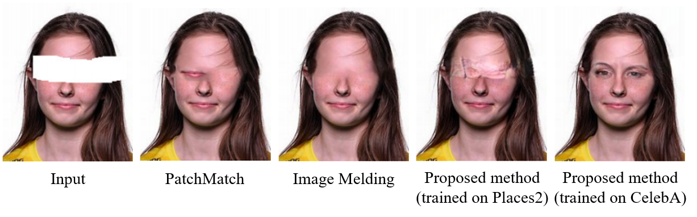
<figcaption>Esempi di Inpainting</figcaption>
</figure>

## Bande di Mach

A sostegno della tesi per cui la percezione visiva è oggettiva e
differente  
dall’intensità luminosa effettiva, portiamo come esempio le bande di
Mach:  
sono 5 bande grigie di 5 intensità diverse. Apparentemente l’intensità
luminosa non è uniforme, e tende a cambiare in prossimità dei bordi
delle bande, cosa che tuttavia, non avviene effettivamente. Questo
dimostra quindi che l’intensità luminosa viene percepita in maniera
differente in ambienti scuri e in ambienti chiari.  
È stato inoltre scientificamente dimostrato che l’intensità luminosa
percepita cresce in maniera logaritmica rispetto a quella effettiva.

<figure>
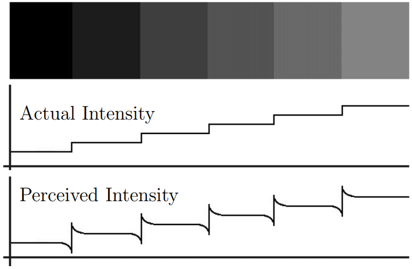
<figcaption>Bande di Mach: intensità effettiva vs percepita</figcaption>
</figure>

# Rappresentazione di un’immagine

## Illuminazione e riflettanza

Un’immagine è rappresentata da una funzione bidimensionale
*f*(*x*, *y*), dove *x* e *y* sono coordinate spaziali, e la
*f*(*x*, *y*) è proporzionale alla luce incidente nell’oggetto e
riflessa da esso, e quindi:
*f*(*x*, *y*) = *r*(*x*, *y*) \* *i*(*x*, *y*)
0 \< *i*(*x*, *y*) \< +∞
0 \< *r*(*x*, *y*) \< 1
Dove *i* indica l’illuminazione ed *r* la riflettanza.  
L’indice di riflettanza è relativo al materiale, ed è un numero limitato
e compreso tra 0 e 1, a differenza dell’illuminazione, potenzialmente
illimitato.

## Discretizzare per digitalizzare

*f*(*x*, *y*) è un valore reale dato dal prodotto descritto dalla
formula precedente. Tuttavia, non potendo lavorare con valori reali, è
fondamentale discretizzarli, e lo stesso vale anche per le variabili.  
Le varibili *x* e *y* sono dette variabili spaziali o coordinate
spaziali, appartengono al piano *X**Y*, per cui *f*(*x*, *y*) indica
l’intensità luminosa in un punto di coordinate (*x*, *y*).

## Immagini vettoriali e Raster

Le immagini Raster hanno un numero limitato di punti, dato dalla
risoluzione dell’immagine.  
L’idea dietro le immagini vettoriali, invece, è quella di descrivere le
forme da creare come una lista di primitive geometriche.  
Il programma si occuperà poi del rendering della grafica vettoriale,
specificando il livello di dettaglio tramite la variabile Q di
vettorializzazione. La differenza tra Raster e vettoriale è chiara, in
quanto le prime sono invece una collezione di pixel (abbreviazione di
picture elements).  
Date queste differenze, i due tipi di immagini si prestano a circostanze
di tipo differente:

-   **Raster:**  
    Fotorealismo, disegno libero, immagini dettagliate e poco
    geometriche.

-   **Vettoriale:**  
    Disegno geometrico, loghi, GIS, PDF, immagini e disegni da dettagli
    minimi.

<figure>
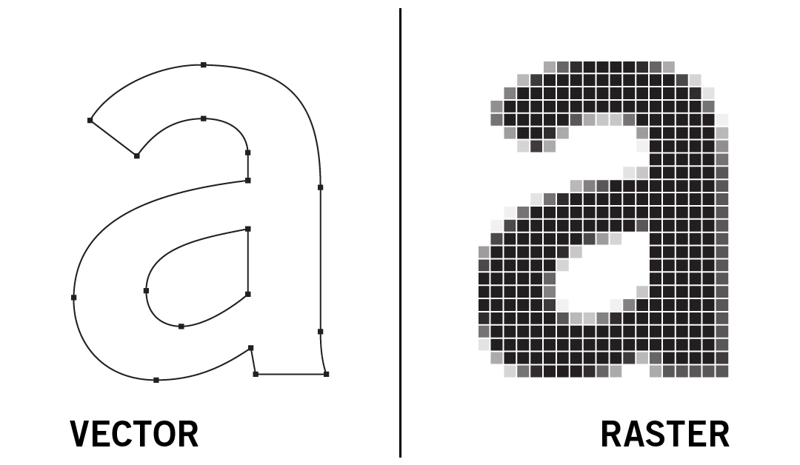
<figcaption>Differenza tra immagine Vettoriale e Raster</figcaption>
</figure>

Da ora in poi parleremo esclusivamente di immagini Raster.

## Immagini Raster come matrice

Un’immagine Raster è una matrice di valori. Ciascuno di questi valori è
associato all’intensità luminosa. Ciò significa che l’immagine è data
dal variare dell’intensità luminosa *f*(*x*, *y*) in ogni punto di
coordinare (*x*, *y*).  
Per convenzione, poniamo sempre l’origine della matrice (o griglia) in
alto a sinistra. Le coordinate sono sempre espresse in termini positivi.

## Tipologie di immagini

-   **Bianco e nero:**  
    A ogni (*i*, *j*) della matrice coincide un valore *f*(*i*, *j*)
    variabile tra 0 e 1. Un singolo bit per punto. 0 coincide col nero,
    1 coincide col bianco.

-   **Scala di Grigi:**  
    A ogni (*i*, *j*) della matrice coincide un valore *f*(*i*, *j*)
    incluso tra 0 e 255. Vengono utilizzati 8 bit. 0 coincide col nero,
    255 coincide col bianco.

-   **A colori:**  
    Nel caso delle codifiche simil-RGB, ogni (*i*, *j*) della matrice
    coincide un valore una terna di valori
    *f*(*i*, *j*) = (*x*, *y*, *z*) inclusi tra 0 e 255. Vengono
    utilizzati 8 bit per canale, con 3 canali sono 24 bit in totale. 0
    coincide con l’intensità minima della componente, 255 coincide con
    quella massima.  
    In codifiche alternative, i valori possono descrivere altre
    caratteristiche del colore di coordinate (*i*, *j*). Ad esempio, con
    la codifica HSL indicheremo *Hue, Saturation and Lightness*, ovvero
    crominanza, saturazione e luminosità.

## Immagini RGB

Le immagini con codifica RGB sono risultato dell’unione di 3 canali
(ciascuno per ogni componente di un colore) per punto: un canale
dedicato alla componente rossa, uno a quella verde e uno a quella blu.

# Operazioni su Immagini e Matrici

Poter codificare un’immagine come una matrice, implica il poter
operare  
sull’immagine con le stesse operazioni definite per le matrici.  
Tuttavia, non tutte le operazioni tra matrici sono sensate nell’ambito
delle immagini. L’esempio più banale è il prodotto riga per colonna, che
nella maggior parte dei casi, porta come risultato un’immagine
irriconoscibile.

## Qualche nozione

Il vicinato *N**p* di un dato pixel sono i *p* pixel
adiacenti.  
Esistono due tipi di vicinato p-connesso:

-   Vicinato 4 connesso include i 4 pixel adiacenti (sopra, sotto,
    sinistra e destra)

-   Vicinato 8 connesso include anche i 4 pixel in diagonale.

## Trasformazioni affini

Una trasformazione di rimappaggio delle coordinate prende in input delle
coordinate, tornando in output delle nuove coordinate.  
La trasformazione si dice affine se preserva tutti i parallelismi
dell’immagine. Ogni trasformazione ha come risultato la modifica della
posizione dei pixel dell’immagine.  
Breve lista di operazioni affini:

-   **Identità:**  
    Non modifica l’immagine (la matrice).  
    T = Matrice identità.

-   **Scaling:**  
    Altera le dimensioni sull’asse x e sull’asse y. $T =
    	      \begin{bmatrix}
    	      	c_x & 0   & 0 \\
    	      	0   & c_y & 0 \\
    	      	0   & 0   & 1 
    	      \end{bmatrix}$

-   **Rotazione:**  
    Ruota i pixel dell’immagine. $T =
    	      \begin{bmatrix}
    	      	cos\Theta  & sin\Theta & 0 \\
    	      	-sin\Theta & cos\Theta & 0 \\
    	      	0          & 0         & 1 
    	      \end{bmatrix}$

-   **Traslazione:**  
    Sposta i pixel sui due assi. $T =
    	      \begin{bmatrix}
    	      	1   & 0   & 0 \\
    	      	0   & 1   & 0 \\
    	      	t_x & t_y & 1 
    	      \end{bmatrix}$

-   **Shear verticale:** $T =
    	      \begin{bmatrix}
    	      	1   & 0 & 0 \\
    	      	s_v & 1 & 0 \\
    	      	0   & 0 & 1 
    	      \end{bmatrix}$

-   **Shear orizzontale:** $T =
    	      \begin{bmatrix}
    	      	1 & s_h & 0 \\
    	      	0 & 1   & 0 \\
    	      	0 & 0   & 1 
    	      \end{bmatrix}$

Ogni trasformazione è quindi ottenuta moltiplicando la riga delle
coordinate \[*x*, *y*, 1\] (in coordinate omogeene) per la matrice di
trasformazione *T*.

## Forward e backward (o inverse) mapping

Nell’ambito dell’image processing, forward e backward mapping sono due
approcci differenti alla trasformazione delle immagini (tramite funzione
di rimappaggio).

-   **Forward mapping:**  
    Si scorre ogni pixel dell’immagine di input, si applica la matrice
    *T* per calcolare la nuova posizione dei pixel nell’immagine
    d’output.

-   **Backward mapping:**  
    Si scorre ogni pixel dell’immagine di output, campionando il pixel
    corretto dall’immagine di input, basandosi sulla matrice
    *T*−1.

### Esempio di Backward mapping

**Rotazione:** $\Theta = \frac{\pi}{2}$
$$T =
\begin{bmatrix}
	cos\Theta  & sin\Theta & 0 \\
	-sin\Theta & cos\Theta & 0 \\
	0          & 0         & 1 
\end{bmatrix};$$
$$T^{-1} =
\begin{bmatrix}
	cos\Theta & -sin\Theta & 0 \\
	sin\Theta & cos\Theta  & 0 \\
	0         & 0          & 1 
\end{bmatrix}
\Rightarrow 
\begin{bmatrix}
	0 & -1 & 0 \\
	1 & 0  & 0 \\
	0 & 0  & 1 
\end{bmatrix}$$
È solo un caso che *T*−1 sia la trasposta di *T* Calcoliamo
la posizione di alcuni pixel della seguente immagine (che
rappresenteremo come matrice): $\begin{bmatrix}
	1 & 2 & 3 \\
	4 & 5 & 6 \\
	7 & 8 & 9 
\end{bmatrix}$
*Coordinate di 1: *\[0, 0, 1\]
*Coordinate di 2: *\[0, 1, 1\]
*Coordinate di 3: *\[0, 2, 1\]
*Non scrivo le coordinate degli altri punti in quanto so già che
finiranno fuori dall’immagine.*
$$1: \[0, 0, 1\] \* \begin{bmatrix}
0 & -1 & 0 \\
1 & 0 & 0 \\
0 & 0 & 1 
\end{bmatrix} = \[0, 0, 1\]$$

$$2: \[1, 0, 1\] \* \begin{bmatrix}
0 & -1 & 0 \\
1 & 0 & 0 \\
0 & 0 & 1 
\end{bmatrix} = \[0, -1, 1\]$$

$$3: \[2, 0, 1\] \* \begin{bmatrix}
0 & -1 & 0 \\
1 & 0 & 0 \\
0 & 0 & 1 
\end{bmatrix} = \[0, -2, 1\]$$
*Procederò calcolando la posizione degli altri pixel. Non scrivo i
calcoli in quanto saranno tutti fuori dall’immagine di partenza.*  
Immagine risultante:
$$\begin{bmatrix}
	1 & X & X \\
	2 & X & X \\
	3 & X & X 
\end{bmatrix}$$
Uso *X* per indicare sezioni vuote.

### Vantaggi del Backward mapping

Approcciandosi alla trasformazione a partire dall’immagine d’output, i
calcoli saranno solo relativi ai pixel dell’immagine che vogliamo
ottenere. Non andremo a calcolare la posizione di pixel out-of-bounds.  
Risolviamo inoltre il problema dei buchi che possono essere generati con
le trasformazioni in forward mapping, come nel caso dello scaling o
della rotazione.

# L’interpolazione

È un’operazione matematica che ci permette di costruire la funzione
interpolante *V*(*x*, *y*), che permette di calcolare i valori non noti
all’interno di uno o più intervalli cui estremi sono noti.

## Zooming in

La trasformazione di scaling, nel caso specifico dello zooming in,
genera  
un’immagine di dimensione maggiore da quella di partenza, con dei vuoti
tra i pixel dell’immagine di partenza.  
I seguenti algoritmi permettono di stimare in maniera più o meno
adatta  
l’intensità dei nuovi pixel intermedi.

### Nearest neighbour

Sceglie il valore di intensità del pixel noto più vicino. A parità di
vicinanza, segue una regola arbitraria. Algoritmo più semplice, scarsi
risultati.
$$\begin{bmatrix}
	10 & ? & 20 & ? \\
	?  & ? & ?  & ? \\
	30 & ? & 40 & ? \\
	?  & ? & ?  & ? \\
\end{bmatrix}$$
Risultato:
$$\begin{bmatrix}
	10 & 10 & 20 & 20 \\
	10 & 10 & 20 & 20 \\
	30 & 30 & 40 & 40 \\
	30 & 30 & 40 & 40 \\
\end{bmatrix}$$

### Interpolazione bilineare

Si prendono come riferimento i 4 pixel adiacenti (o più vicini) noti,
per stimare l’intensità del pixel di intensità non nota. Il valore
assegnato si ottiene con l’equazione
*V*(*x*, *y*) = *a**x* + *b**y* + *c**x**y* + *d*  
Esempio:
$$\begin{bmatrix}
	10 & ? & 20 \\
	?  & ? & ?  \\
	30 & ? & 40 
\end{bmatrix}$$
$$\begin{cases}
	V(0,0): 10 = 0 + 0 + 0 + d   \\
	V(2,0): 20 = 2a + 0 + 0 + d  \\
	V(0,2): 30 = 0 + 2b + 0 + d  \\
	V(2,2): 40 = 2a + 2b + 0 + d 
\end{cases};$$

$$\begin{cases}
	V(0,0): d = 10           \\
	V(2,0): 2a + d = 20      \\
	V(0,2): 2b + d = 30      \\
	V(2,2): 2a + 2b + d = 40 
\end{cases};$$

$$\begin{cases}
	V(0,0): d = 10 \\
	V(2,0): a = 5  \\
	V(0,2): b = 10 \\
	V(2,2): c = 0  
\end{cases};$$
Otteniamo la funzione:
*V*(*x*, *y*) = 5*x* + 10*y* + 0*x**y* + 10
Calcolo il pixel di coordinate (0, 1):
*V*(0, 1) = 10 + 10 = 20
Calcolo il pixel di coordinate (1, 0):
*V*(1, 0) = 5 + 10 = 15
Calcolo il pixel di coordinate (1, 1):
*V*(1, 1) = 5 + 10 + 10 = 25
Calcolo il pixel di coordinate (2, 1):
*V*(2, 1) = 10 + 10 + 10 = 30
Calcolo il pixel di coordinate (1, 2):
*V*(1, 1) = 5 + 20 + 10 = 35

Immagine finale:
$$\begin{bmatrix}
	10 & 15 & 20 \\
	20 & 25 & 30 \\
	30 & 35 & 40 
\end{bmatrix}$$

### Interpolazione bicubica

Utilizza i sedici pixel più vicini al punto.
$$v(x,y) = \sum\_{i=0}^{3} \sum\_{j=0}^{3} a\_{i,j} x^iy^j$$
Non la approfondiamo, ma sappiamo che produce una formula di
interpolazione molto accurata, grazie ai numerosi valori presi in
considerazione per le stime. Più pesante computazionalmente.

### Problema dei bordi

A ridosso dei bordi dell’immagine, il numero di pixel adiacenti è
minore, e non risulterà possibile usare in maniera precisa gli algoritmi
di interpolazione. Due sono le possibili soluzioni:

-   Non fare nulla, replicando i valori di righe e colonne adiacenti.

-   Usare un algoritmo che prende come riferimento un numero minore di
    pixel adiacenti.

## Zooming out

Esistono anche dei metodi da usare nel caso dello zooming out, che
genera immagini di dimensioni minori. Esempio di soluzioni sulla
seguente matrice:
$$\begin{bmatrix}
	1  & 2  & 3  & 4  \\
	5  & 6  & 7  & 8  \\
	9  & 10 & 11 & 12 \\
	13 & 14 & 15 & 16 \\
\end{bmatrix}$$

### Decimazione

Teniamo un pixel seguendo una regola arbitraria (quello in alto a
sinistra ogni 4 pixel, in questo caso):
$$\begin{bmatrix}
	1 & 3  \\
	9 & 11 \\
\end{bmatrix}$$

### Media

In questo caso ogni due pixel in orizzontale e due in verticale,
arrotondando per difetto:
$$\begin{bmatrix}
	3  & 5  \\
	11 & 13 \\
\end{bmatrix}$$
Procedure di calcolo della media hanno però un difetto, come vedremo
spesso nel corso: possono generare nuovi colori inesistenti
nell’immagine di partenza.

# Stima della qualità di un algoritmo

## MSE - Mean Square Error

È un parametro usato per stimare l’errore quadrato medio tra due
immagini, ed è direttamente proporzionale alle loro differenze.

## PSNR - Peak Signal to Noise Ratio

Usato per valutare la qualità della compressione di un’immagine
rispetto  
all’originale. È una tecnica Full reference, ovvero richiede la presenza
di due immagini, una di riferimento e una da valutare, e indicheremo la
prima con *I*(*M* × *N*) e la seconda con *I*′(*M* × *N*).  
Non è il miglior parametro per valutare un algoritmo di interpolazione,
ma è il più diffuso.

## PSNR: Formule

Calcolo del Mean Square Error (servirà per calcolare il PSNR)
$$MSE = \frac{1}{MN}\sum^M\_{x=1}\sum^N\_{y=1} \[ I'(x,y) - I(x,y)\]^2$$
PSNR - Varie formule equivalenti
$$PSNR = -10log\_{10}\frac{MSE}{S^2}$$
$$PSNR = 20log\_{10}\frac{S}{\sqrt{MSE}}$$
$$PSNR = 10log\_{10}\frac{S^2}{MSE}$$
Dove *S* è il valore massimo di intensità dei pixel (solitamente 255).

### Esempi di calcolo MSE e PSNR

$$G =
\begin{bmatrix}
	0 & 0 \\
	0 & 0 
\end{bmatrix}$$
$$G' =
\begin{bmatrix}
	255 & 255 \\
	255 & 255 
\end{bmatrix}$$
$$MSE(G, G') = \frac{1}{2\*2}\sum^2\_{x=1}\sum^2\_{y=1}\[G' - G\]^2 = 255^2$$

$$I =
\begin{bmatrix}
	100 & 200 \\
	10  & 30  
\end{bmatrix}$$
$$I' =
\begin{bmatrix}
	101 & 201 \\
	12  & 28  
\end{bmatrix}$$
$$MSE(I, I') = \frac{1}{2\*2}\sum^2\_{x=1}\sum^2\_{y=1}\[I' - I\]^2 = \frac{7}{4};$$
$$PSNR(I, I') = 10log\_{10}\frac{255^2}{\frac{7}{4}} = 45,7;$$
Il risultato del calcolo del PSNR è espresso in decibel
(10*l**o**g*10).  
MSE e PSNR sono valori molto sensibili alle trasformazioni affini:
confrontare un’immagine con la versione traslata, ruotata o
ridimensionata di se stessa, avrà un forte impatto su valori di MSE e
PSNR, per quanto sia molto semplice, per un essere umano, riconoscere le
due immagini come uguali.
*M**S**E* ∈ \[0, 2552\]
*O in generale il massimo numero rappresentabile col numero di bit
dedicato all’intensità, al quadrato*
*P**S**N**R* ∈ \[0, +*n*.*b**i**t*2\[

## Svantaggi del PSNR

Il PSNR non è un metodo che rispecchia alla perfezione il criterio
umano: infatti, come l’essere umano riconoscerà le somiglianze tra due
immagini trasformate, il PSNR potrebbe associare un valore di qualità
molto alto a un immagine con molti pixel simili all’originale, ma cui
soggetti sono irriconoscibili.

# Acquisizione delle immagini digitali

Quando la luce colpisce un oggetto, parte di essa viene assorbita,
l’altra viene riflessa. La riflessione dell’oggetto da origine al colore
percepito. Catturare tramite un sensore la luce riflessa ed elaborarla,
permette la creazione di un’immagine digitale.

## Il sensore

L’ausilio di un sensore è fondamentale per catturare un’immagine
digitale:  
l’energia che colpisce il sensore viene trasformata in inpulso
elettrico. Esso sarà poi convertito in digitale. In strumenti diversi
vengono utilizzati sensori di tipo differente:

-   **Singolo sensore, spostamento in linea**:  
    Usato negli scanner, il sensore viene spostato lungo la sorgente da
    digitalizzare

-   **Sensori disposti in 2D**:  
    Sono disposti in una matrice, permettono di catturare più punti
    contemporeaneamente senza richiedere uno spostamento, la cattura di
    tutti i sensori è simultanea. I più comuni sono i CCD.

### CCD: Charged Coupled Device

Dispositivi che si caricano positivamente se compiti da fotoni. Il
numero di celle per area di esposizione è misurato in MEGAPIXEL. Le
celle del CCD non possono caricarsi oltre una certa soglia
(sovra-saturazione).

### Dettagli sul processo di cattura

Successivamente all’acquisizione delle cariche da parte della matrice
delle celle, avviene la scansione di ciascuna colonna della matrice.
Essa richiederà un numero *C* di fasi, dove *C* è il numero di colonne.
Scannerizzata la prima colonna, la carica già acquisita verrà spostata
in memoria per fare spazio alle successive, che si sposteranno nella
colonna appena liberata.

### Cattura di un’immagine a colori

Non è possibile creare un tipo di sensore capace di catturare specifici
colori, ma, usando un consono sistema di filtri, è possibile catturare i
valori delle singole componenti dei colori.

### Color Filter Array

È il nome con cui indichiamo la dispozione dei filtri colorati sui
sensori. Il più usato, è il Bayer Pattern.

### Bayer Pattern

È lo schema più utilizzato, sfrutta un rapporto 1:2:1 per i canali RGB.
I pixel verdi sono disposti sulla diagonale.

<figure>
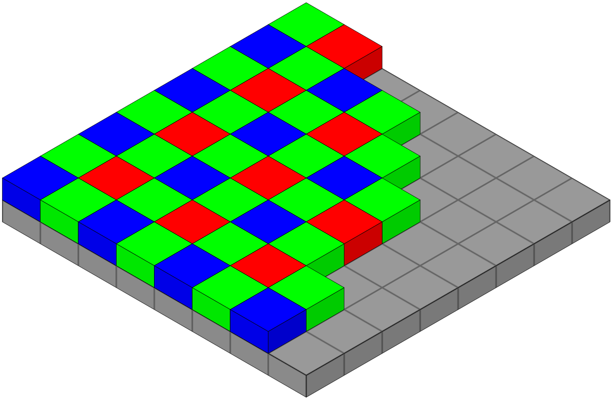
</figure>

Il risultato di una cattura tramite il Bayer Pattern, è in formato RAW.
Il colorplane Bayer deve essere poi interpolato, tramite software, per
ottenere i colori effettivi.

### Color Interpolation

È il processo che permette di passare dall’immagine RAW, cui Bayer
pattern è ancora riconoscibile (false-color), all’immagine cui colori
sono quelli effettivi (true-color).

<figure>
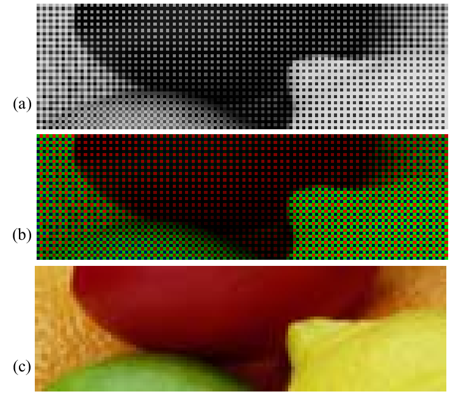
</figure>

Esistono numerosi algoritmi usati nell’ambito della color interpolation.
La nearest-neighbour interpolation, l’interpolazione bilineare o la
bicubica possono essere usate per ricostruire i pixel delle immagini
RGB. Dato un qualsiasi pixel, sarà solitamente noto uno dei suoi 3
valori RGB. Gli altri possono essere ottenuti tramite interpolazione. In
questo modo, otterremo una terna di valori che indica il true-color.

# Risoluzione

## Definizione e unità di misura

La più piccola e indivisibile unità di un’immagine Raster è un pixel.  
La risoluzione offre una misura sul quantitativo di pixel dedicati alla
rappresentazione di un’immagine. Si dice risoluzione il numero di pixel
per unità di misura.  
È misurabile in pixel al centimetro o dots per inch (dpi), o essere
espressa come il numero di pixel su tutta l’immagine (esempio: 16
MegaPixel).

## Risoluzione: indice di qualità?

È improprio dire che la risoluzione è indice di qualità di
un’immagine?  
Una risoluzione piuttosto alta permette di rappresentare punti molto
piccoli e indistinguibili, permettendo a un’immagine di non risultare
sgranata. Tuttavia, la qualità dell’immagine, in termini di risoluzione,
è il risultato della risoluzione dello strumento di ripresa e di quello
di resa (esempio: fotocamera e monitor)

### Risoluzione apparecchiatura di ripresa

È data dal numero di sensori per unità lineare di misura. Uno scanner
arriva oltre i 6000 dpi. La risoluzione delle fotocamere è invece spesso
espressa in MEGAPIXEL.

### Risoluzione apparecchiatura di resa

È data dal numero di punti per unità lineare di misura. Gli schermi
hanno tipicamente 72 dpi.  
Stampanti oltre 3000 dpi.  
Risoluzione di stampe:

-   Quotidiano: 75 dpi

-   Riviste; 133 dpi

-   Brochure 175 dpi

-   Libri Fotografici 2400 dpi

La risoluzione di un’immagine offre un’indice di "densità" di pixel, o
punti, rispetto ad un’unità di misura: una densità maggiore si presta
alla rappresentazione di determinate geometrie o immagini con un certo
livello di dettaglio.  
La massima resa di un’immagine è data da un’equivalenza tra la
risoluzione dell’immagine e di quello di resa: qualsiasi altra
circostanza implica interpolazione.

### Rapporto

Il rapporto di un’immagine offre un’informazione riguardo le proporzioni
di altezza e larghezza della risoluzione dell’immagine.  
*\[Nota bene: i dpi non sono in relazione con la risoluzione e il
rapporto.\]*

# L’occhio

## La retina

È una membrana che ricopre la parte posteriore dell’occhio, ed è
costituita da coni e bastoncelli fotorecettivi. Intercettando stimoli
luminosi, producono stimoli elettrici.

### I coni

Sono circa 6/7 milioni, e sono concentrati principalmente nella zona
centrale della retina, la fovea (/fò·ve·a/).  
Sono fortemente sensibili al colore, e ad ogni cono è collegato un nervo
ottico. I coni distinguono specifiche lunghezze d’onda.

### I bastoncelli

Sono circa 75/150 milioni, distribuiti su tutta la retina. Reagiscono
all’intensità luminosa e non alla lunghezza d’onda. Sono i responsabili
della vista scotopica (visione dell’occhio normale quando
l’illuminamento degli oggetti è debole). Gruppi di bastoncelli sono
collegati a singoli nervi.

### Altro da sapere sulla retina

La fovea è una regione di 1, 5*m**m* × 1, 5*m**m*. Nella fovea sono
presenti 150.000 coni per *m**m*2, per un totale di 337.500.
Un CCD può contenere lo stesso numero di recettori in non meno di
5*m**m* × 5*m**m*.

## Pinhole, cristallino e messa a fuoco

Il modello Pinhole è un modello che permette di astrarre il problema
della formazione dell’immagine dell’occhio:  
Si approssima l’occhio a una scatola scura, foriamo con uno spillo (pin
hole) una parete della scatola e poniamo, nella parete interna opposta
al foro, una pellicola fotosensibile (che simula la retina).

<figure>
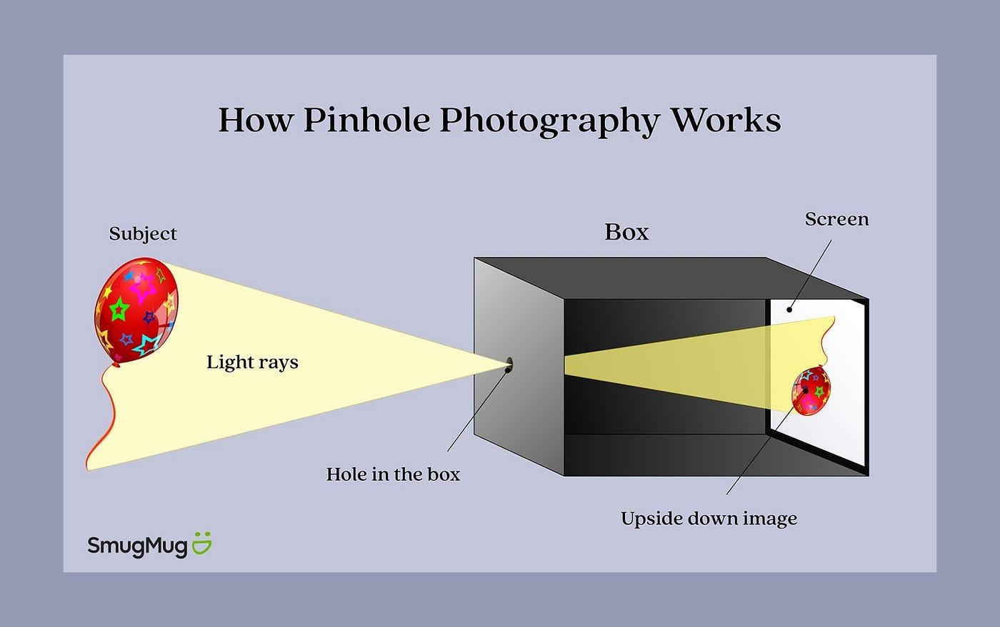
<figcaption>Modello Pinhole</figcaption>
</figure>

Il foro della pupilla, non essendo veramente puntiforme, permette
l’accesso a più proiezioni di luce dallo stesso punto: la proiezione
sulla retina di un punto dovrebbe di conseguenza diventare quella di un
cerchio. Tuttavia, grazie alla deviazione del cristallino, la proiezione
viene corretta. Il cristallino, infatti, essendo flessibile, si adatta
alle distanze che vogliamo mettere a fuoco.

## Sulle fotocamere

Le lenti delle fotocamere non sono deformabili: per questo motivo,
tramite un sistema manuale o automatico, è possibile cambiare la
distanza della superficie fotosensibile rispetto al foro, per permettere
la messa a fuoco di soggetti a varie distanze. Nel modello pinhole, il
raggio del foro è proporzionale alla radice quadrata della distanza per
la lunghezza d’onda della luce emessa.
$$r = \sqrt{\lambda d}$$
Tuttavia, per quanto un modello ideale del pinhole risulterebbe
funzionante, un modello reale soffre di molti problemi:

-   Il pinhole reale non presenta un foro puntiforme infinitesimo, in
    quanto non permetterebbe il passaggio della luce

-   Il pinhole reale non può avere nemmeno un foro di dimensioni troppo
    piccole, in quanto genererebbe fenomeni di diffrazione.

-   Un pinhole reale e funzionale presenta un foro di dimensioni
    notevoli ed una specifica forma geometrica. Per quanto questa
    "implementazione" sia funzionante, è soggetta a fenomeni di
    sovrapposizione di più fonti di luce.

    <figure>
    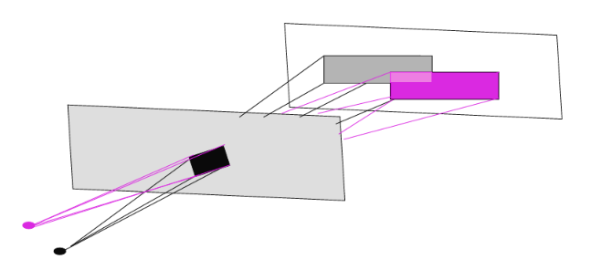
    <figcaption>Sovrapposizione di due fonti luminose
    puntiformi</figcaption>
    </figure>

## Lenti sottili

I fori sono fondamentalmente inadeguati a tale compito: non permettono
di recepire in maniera accurata spettri significativi di radiazione
luminosa. Tuttavia, un risultato migliore può essere ottenuto con
l’ausilio di lenti sottili, ovvero lenti dallo spessore trascurabile.

### Proprietà geometriche della lente sottile

-   Raggi paralleli all’asse della lente sottile che passano attraverso
    essa, vengono proiettati tutti attraverso un punto specifico oltre
    la lente, chiamato fuoco.

-   Una lente sottile ha due fuochi equidistanti da essa.

-   Raggi che passano attraverso il fuoco, sono ritrasmetti tutti
    paralleli nella direzione dell’asse della lente.

### Equazione della lente sottile

Andiamo a trovare un’equazione che metta in relazione i valori indicati
nella seguente immagine:

<figure>
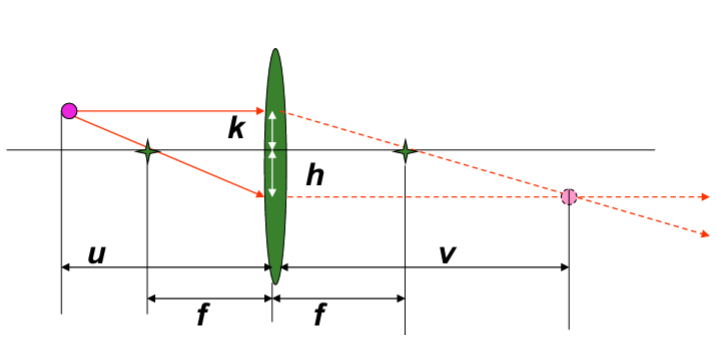
</figure>

  
Individuando dei triangoli simili, possiamo arrivare alla seguente
conclusione:
*u* : (*h* + *k*) = *f* : *h*
Conseguentemente:
$$\frac{u \cdot h}{f} = (h+k)$$
Analogamente, diremo anche che:
*v* : (*h* + *k*) = *f* : *k*
Conseguentemente:
$$\frac{v \cdot k}{f} = (h+k)$$
Eguagliamo:
$$\frac{v \cdot k}{f} = \frac{u \cdot h}{f}$$
$$\frac{h}{v} = \frac{k}{u}$$
Da $(h+k) = \frac{u \cdot h}{f}$ dividiamo entrambi i membri per *u*
ottenendo:
$$\frac{h}{u} + \frac{k}{v} = \frac{h}{f}$$
Ma $\frac{k}{u} = \frac{h}{v}$, e quindi;
$$\frac{h}{u} + \frac{h}{v} = \frac{h}{f}$$
Eliminiamo il fattore comune e ottendiamo definitivamente l’equazione
della lente sottile, ovvero:
$$\frac{1}{u} + \frac{1}{v} = \frac{1}{f}$$

### Messa a fuoco, equazione della lente sottile

Se *f* si misura in metri, $\frac{1}{f} = 1$ diottria.

-   Quando abbiamo una lente fissa, come nelle fotocamere, *f* è una
    quantità costante. Se la distanza dall’oggetto indicata con *u*
    aumenta, la distanza lente - sensore deve diminuire.,

-   Se il piano dei sensori non può allontanarsi, come nel caso della
    pupilla, e quindi *v* è fissa, ciò che possiamo fare è aggiustare la
    lunghezza focale (*f*), mettendo in tensione il cristallino.

-   Due oggetti a distanza *u*1 e *u*2 dalla lente
    sottile, distanze di molto superiori a *f*, appariranno
    approssimatamente sullo stesso piano (in quanto *v*1 e
    *v*2 saranno valori molto vicini); ciò non succede invece
    quando *u*1 ed *u*2 sono a distanze differenti
    e comparabili (meno di 30 volte la distanza della lente), allora non
    sono focalizzabili contemporaneamente. Si presenterà così il
    fenomeno della "profondità di campo".

### Magnificazione

Col termine magnificazione andiamo a indicare la proprietà, della lente
sottile, di alterare la dimensione dell’immagine di un oggetto rispetto
alla dimensione effettiva di esso. Il fattore di magnificazione è dato
da:
$$\frac{h}{k} = \frac{v}{u} = m$$
Moltiplichiamo per *v* l’equazione della lente sottile
$$\frac{v}{u} + 1 = \frac{v}{f}$$
Ovvero
$$m + 1 = \frac{v}{f}$$
Invertiamo:
$$\frac{1}{m+1} = \frac{f}{v}$$
Moltiplichiamo per *u* e sostituiamo $\frac{u}{v} = \frac{1}{m}$.
$$\frac{u}{m+1} = \frac{f}{m}$$
Moltiplichiamo per *m* ottenendo finalmente una relazione tra il fuoco,
la distanza dall’oggetto e il fattore di magnificazione.
$$f = u \cdot \frac{m}{m+1}$$
*\[Annoto qua per comodità tutte le variabili:\]*

-   *u* - distanza oggetto - lente

-   *v* - distanza lente - sensore

-   *f* - fuoco

-   *m* - fattore di magnificazione

### Esercizi sul calcolo:

-   Oggetto a distanza *u* = 1*c**m*.  
    Macchina analogica con *v* = 2*c**m*.  
    Se la farfalla è a distanza *u*1 = 5*c**m* si ha
    $m=\frac{2}{1}=2$ e $f=5 \cdot \frac{2}{3}=3.3cm$

# Campionamento e Quantizzazione

## In cosa consistono?

Per effettuarne una digitalizzazione di un segnale analogico e continuo,
occorre scegliere un numero finito di "campioni" rappresentativi del
segnale.  
Se nel segnale analogico il valore in ogni singolo punto è un numero
reale, la controparte digitale sarà costituita da valori discreti
opportunatamente scelti. Nella seguente immagine, abbiamo un esempio di
campionamento e quantizzazione:

<figure>
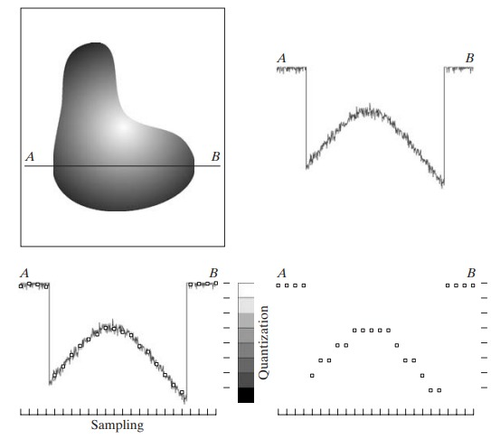
</figure>

  
All’insieme continuo di valori di intensità dell’immagine, viene
associato un insieme discreto di valori.

## Campionamento

Consiste nell’acquisizione di campioni all’interno di un segnale
analogico continuo. Il tasso di campionamento indica il numero di volte
in cui avviene il campionamento del segnale in un determinato lasso di
tempo. La scelta del tasso di campionamento è fondamentale: un
campionamento  
troppo basso fa perdere dettagli o causare fenomeni di aliasing

### Nyquist Rate

Si definisce Nyquist rate il doppio della più alta frequenza di un
segnale continuo e limitato. Nel pratico, rappresenta il dettaglio più
piccolo rappresentabile in un segnale.

### Teorema di Shannon

Raccogliere un numero di campioni maggiore al Nyquist Rate ci permette
di ricostruire il segnale fedelemente in ogni suo punto. Usiamo questo
teorema per scegliere opportunamente la frequenza di campionamento.

### Aliasing

Derivante dal termine "alias", si riferisce al mascheramento delle alte
frequenze come basse frequenze nella fase di campionamento. Questo
genera artefatti, "righette" orizzontali e verticali. Spariscono inotre
dettagli o vengono generate distorsioni in prossimita di linee continue.

<figure>
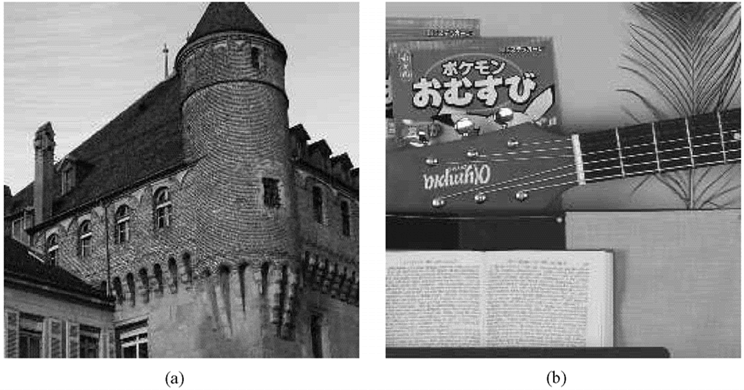
<figcaption>Esempi di Aliasing</figcaption>
</figure>

Un tipo di artefatto particolare generato da una frequenza di
campionamento troppo bassa, è chiamato "Moiré pattern". Nella seguente
immagine è visibile in prossimità dell’orizzonte.

<figure>
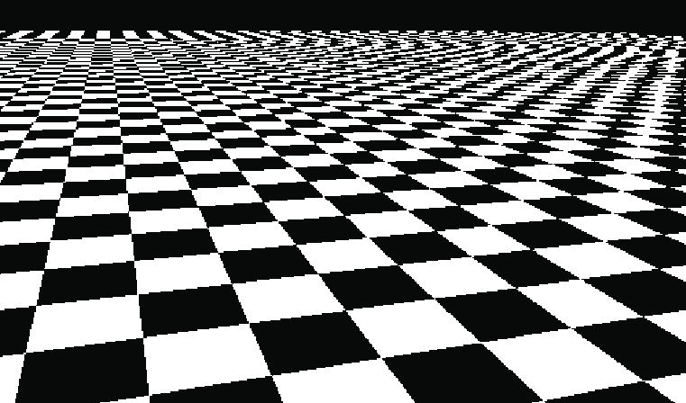
<figcaption>Esempi di Aliasing, Moiré Pattern</figcaption>
</figure>

### Undersampling e aliasing temporale

Nell’ambito dei video, un framerate basso potrebbe causare problemi
relativi alla percezione del movimento degli oggetti, un vero e proprio
alias temporale. Un movimento rotatorio in un verso, dato un basso
framerate, potrebbe rendere in video nel verso opposto.

<figure>
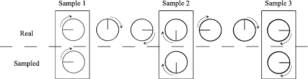
</figure>

## Quantizzazione

È il processo di discretizzazione dei valori reali catturati dopo il
campionamento.  
I sensori, essendo apparati fisici, possono catturare valori continui,
ma anche subire interferenze.

### Procedura generale di quantizzazione

I valori da quantizzare sono nel range \[*a*, *b*\] e si vuole
quantizzare su *n* livelli:

-   Si fissano *n* + 1 numeri
    (*t*0, *t*1, ...*t**n*)
     ∈ \[*a*, *b*\] tali che:
    *t*0 = *a* \< *t*1 \< *t*2 \< ... \< *t**n* = *b*

-   Il numero *x* ∈ \[*a*, *b*\] verrà assegnato al livello di
    quantizzazione *k* se risulta:
    *t**k* ≤ *x* \< *t**k* + 1
    *b* viene assegnato a *t**k*.

### Implicazioni della quantizzazione

Ogni segnale, quando viene quantizzato, presentirà di distorsioni di
quantizzazione. È impossibile andare a quantizzare un segnale continuo
senza introdurre un minimo di distorsione di quantizzazione, in quanto
non è possibile ricostruire un segnale continuo in ogni suo punto, in
quanto infiniti. Tuttavia, una quantizzazione su molti livelli
permetterà di rendere il meno percettibile possibile la differenza tra
il segnare analogico e quello digitalizzato.

### Distribuzione dei livelli di quantizzazione

Quantizzare, significa associare e dei range di frequenze, dei valori
discreti.  
Questi range possono essere di dimensione uniforme o non uniforme.

-   **Uniforme:**  
    I range che vengono associati ad un valore sono di dimensione
    costante. Non richiede uno studio specifico.

-   **Non Uniforme:**  
    I range che vengono associati ad un valore sono di dimensione non
    costante. Conoscendo la percezione umana dell’intensità luminosa, o
    del range di frequenze in generale, è possibile creare una
    quantizzazione ad hoc, con una resa migliore rispetto al contesto.

### Quantizzazione Uniforme

La quantizzazione avviene per mezzo di una funzione lineare
$$L' = \frac{L \cdot K}{N}$$
Dove:

-   *L* è il livello di ingresso rappresentato da un intero.

-   *L*′ è il livello post-quantizzazione.

-   *N* è il numero di livelli del range in ingresso (0, ..., *N* − 1).

-   *K* è il numero di livelli del range in uscita (0, ..., *K* − 1).

### Esempio di quantizzazione uniforme

Immagine a 8 bit ⇒ 256 livelli.  
*N* = 256
$$M = 
	\begin{bmatrix}
		0  & 100 \\
		50 & 200 
	\end{bmatrix}$$
Vogliamo quantizzarla a 3 bit ⇒ 8 livelli.  
*K* = 8
*L*′11 = (0 ⋅ 8)/256 = 0
*L*′12 = (100 ⋅ 8)/256 = 3, 125
*L*′21 = (50 ⋅ 8)/256 = 1, 56
*L*′22 = (200 ⋅ 8)/256 = 6, 25
Prendiamo solo la parte intera dei numeri reali ottenuti. Matrice
risultante:
$$M' = 
	\begin{bmatrix}
		0 & 3 \\
		1 & 6 
	\end{bmatrix}$$

### Quantizzazione non-uniforme

La quantizzazione non uniforme avviene per mezzo di una funzione nella
forma
$$L' = \frac{f(L) \cdot K}{f(N)}$$
Dove:

-   *L* è il livello di ingresso rappresentato da un intero.

-   *L*′ è il livello post-quantizzazione.

-   *N* è il numero di livelli del range in ingresso (0, ..., *N* − 1).

-   *K* è il numero di livelli del range in uscita (0, ..., *K* − 1).

-   *f*(*n*) è una funzione a scelta. La più tipica, è quella
    logaritmica *l**o**g*2(*n*), e quindi:
    $$L' = \frac{log_2(L) \cdot K}{log_2(N)}$$

### Esempio di quantizzazione non-uniforme (logaritmica)

Immagine a 8 bit ⇒ 256 livelli.  
*N* = 256
$$M = 
	\begin{bmatrix}
		0  & 100 \\
		50 & 200 
	\end{bmatrix}$$
Vogliamo quantizzarla a 3 bit ⇒ 8 livelli.  
*K* = 8
*L*′11 = (*l**o**g*2(0) ⋅ 8)/*l**o**g*2(256) = *Non calcolabile* = 0
*L*′12 = (*l**o**g*2(100) ⋅ 8)/*l**o**g*2(256) = *l**o**g*2(100) = 6, 64
*L*′21 = (*l**o**g*2(50) ⋅ 8)/*l**o**g*2(256) = *l**o**g*2(50)=
*L*′22 = (*l**o**g*2(200) ⋅ 8)/*l**o**g*2(256) = *l**o**g*2(200)=
Prendiamo solo la parte intera dei numeri reali ottenuti. Matrice
risultante:
$$M' = 
	\begin{bmatrix}
		0 & 3 \\
		1 & 6 
	\end{bmatrix}$$

# Colore

## I colori come onda elettromagnetica

Un raggio luminoso di colore bianco, attraverso un prisma di vetro,
viene suddiviso nel suo spettro. Chiameremo questo spettro "luce
visibile", ed include tutte quelle lunghezze donda tali da appartenere a
questo spettro.

### Lo spettro elettromagnetico

Le onde elettromagnetiche visibili appartengono ad un range, chiamato
"range della luce visibile". Sono onde cui stimoli fanno reagire la
retina. Le lunghezze d’onda del range visibile vanno da circa 400
nanometri a 700 nanometri. Subito sotto i 400 nanometri abbiamo gli
infrarossi, oltre i 700 nanometri abbiamo gli ultravioletti.
*λ* \* *f* = *c*
Dove *λ* e *f* sono rispettivamente lunghezza d’onda e frequenza delle
onde elettromagnetiche. *c* è la costante che indica la velocità della
luce.

### La luce visibile

Abbiamo già detto che la luce visibile è nel range dei
\[400*n**m*, 700*n**m*\]. Dividiamo per comodità lo spettro in sei
regioni di dimensione irregolare: violetto, blu, verde, giallo, arancio
e rosso.

### Percezione del colore degli oggetti

L’essere umano percepisce il colore di un oggetto la componente di luce
che non viene assorbita, e bensì riflessa dall’oggetto.  
Questo significa che un oggetto cui superficie assorbe tutte le regioni
dello spettro della luce visibile, eccetto la regione verde, risulterà
proprio di colore verde.

### Descrivere la luce

Sono tre i valori sufficienti a descrivere la luce:

-   Radianza: quantità di luce emessa dalla sorgente luminosa

-   Luminanza: energia percepita dall’utente

-   Brillantezza: un valore soggettivo che indica la sensazione di
    colore

### I coni e il loro spettro di assorbimento

Nella retina sono presenti tre tipi di coni.

-   **Tipo S**  
    Lunghezze d’onda corte, short, colori bluastri

-   **Tipo M**  
    Lunghezze d’onda medie, middle, verdastri

-   **Tipo L**  
    Lunghezze d’onda lunghe, long, rossastri

<figure>
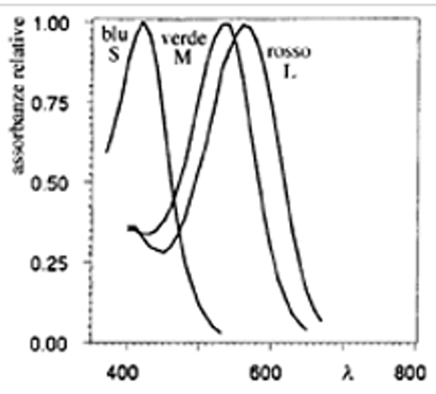
</figure>

## Colore e soggettività:

Il riconoscimento dei colori da parte dell’uomo è basato sulla luce,
sugli oggetti che riflettono la luce e sugli occhi e il cervello
dell’osservatore.

### Differenze di colore

Elementi che portano a differenze nelle percezioni di colore.

-   **Differenze di sorgenti luminose:**  
    Luce nell’ambiente circostante.

-   **Differenze di osservatore:**  
    Sensibilità differenti al colore

-   **Differenze di dimensioni:**  
    Effetto area = colori che ricoprono spazi più vasti appaiono più
    vivaci e luminosi

-   **Differenze di sfondo:**  
    Effetto contrasto = colori più cupi se lo sfondo è scuro

-   **Differenze di direzione:**  
    Caratteristche direzionali di alcune vernici.

# Spazi di colore

## Introduzione agli spazi di colore

Gli spazi di colore nascono con lo scopo di permettere la specificazione
di colori, con modalità standardizzate, che fanno solitamente
riferimento ad un sistema di coordinate all’interno di un sottospazio
tridimensionale, nel quale ogni colore è rappresentato da un punto.  
Introduciamo questo capitolo con la sfatata teoria del tristimolo.

### Teoria del tristimolo (Young, 1802)

È l’ipotesi secondo cui ogni colore può essere ottenuto mescolando tre
colori fondamentali in proporzioni differenti. Nonostante la sua
incorrettezza, è stata alla base delle codifiche utilizzate ancora oggi
per i colori.

### Composizione dei colori

Illuminando una superficie bianca (coefficiente di riflessione del 100%)
con una o più luci monocromatiche, si ottiene (per riflessione) una
radiazione colorata per sintesi additiva.  
Partendo dalla ipotesi che ogni colore possa essere valutato in termini
di tre componenti pure, la CIE (Commissione Internazionale per
l’Illuminazione) ha scelto le tre radiazioni primarie in modo che le
lunghezze d’onda siano il più possibile distanziate nello spettro,
ottenendo quindi:
*B**l**u* = 435, 8 *n**m*; *V**e**r**d**e* = 546, 1 *n**m*; *R**o**s**s**o* = 700 *n**m*
Anche se dati sperimentali hanno dimostrato che il valore reale è
lievemente differente:
*B**l**u* = 445 *n**m*; *V**e**r**d**e* = 535 *n**m*; *R**o**s**s**o* = 575 *n**m*

### Colori primari e secondari

Chiameremo rosso, verde e blu "colori primari" o "primari additivi", e
combinando i colori in questione due a due, otteniamo i "colori
secondari", o "primari sottrattivi", ovvero magenta, ciano e giallo.

### Diagramma cromatico CIE

-   *x* è la quantità di rosso

-   *y* è la quantità di verde

-   *z* = 1 − (*x* + *y*) è la quantità di blu

La rappresentazione grafica al variare di *x* e *y* da origine al
diagramma cromatico CIE, di cui possiamo denotare alcune caratteristiche
interessanti:

-   Il punto di uguale energia tra le tre componenti contiene il bianco.
    Tutti i punti ai bordi non ha bianco, e sono detti colori puri.

-   Unendo due colori con una linea, tutti i colori nella linea sono
    ottenibili mescolando i due colori

-   Unendo un colore con il bianco si ottengono tutte le tonalità di
    quel colore.

-   Unendo tre colori con un triangolo, tutti i colori lungo il bordo e
    nel triangolo sono quelli ottenibili mischiando quei tre colori

-   Notiamo inoltre il triangolo di spigoli R, G, B non copre tutta
    l’area del diagramma cromatico, sfatando quindi la teoria del
    tristimolo.

Se permettiamo a questi tre valori di variare, diventa chiaramente
possibile rappresentare ogni colore dello spettro visibile. Tuttavia,
ciò implica l’impossibilà di fissare tre componenti fondamentali
standard.

<figure>
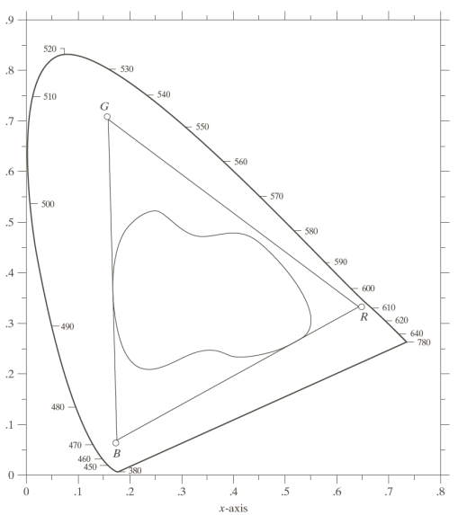
<figcaption>Color gamut (gamma di colori)</figcaption>
</figure>

L’area convessa più grande include tutta la luce visibile. Il triangolo
unisce le tre lunghezze d’onda fissate dallo standard CIE. L’area
ulteriormente più piccola inscritta nel triangolo, è la gamma di colori
di una stampante (colori ottenuti per sintesi sottrattiva)

### Spazi percettivamente non uniformi

Un problema relativo agli spazi di colore del sistema CIE è quello
legato alla non-uniformità:  
due colori equidistanti da due valori, non sono percepiti come
equidistanti.

### CIELAB

È, assieme allo spazio L\*u\*v\*, uno spazio di colore percettivamente
uniforme. *L*\* indica la luminanza, *a*\* e *b*\* la crominanza. Sono
tutti e tre trasformazioni dei valori di tristimolo *X*, *Y*, *Z* dello
spazio di colore *C**I**E* *X**Y**Z*. Nello spazio di colore in
questione, le differenze di colore sono definite come distanze tra due
punti:
$$\Delta E^\*\_{ab} = \sqrt{\Delta L^{\*2} + \Delta a L^{\*2} + \Delta b L^{\*2}}$$
*L*\* = 100: bianco, *L*\* = 0: nero,
*a*\*, *b*\*= coordinate di cromaticità.

### Spazio LCh

Chroma:
$$C^\* = \sqrt{(a^\*)^2 + (b^\*)^2}$$
Hue angle:
$$h = \tan^{-1}(\frac{b^\*}{a^\*})$$

## Spazio di colore HSV

### Illuminanti

Si definisce come illuminante una luce teorica, presumibilmente dalla  
distribuzione spettrale nota, capace di alterare il colore percepito
degli oggetti. Lo spettro di un illuminante è il diagramma dei
contributi di energia che esso apporta a ciascuna differente lunghezza
d’onda.

#### I metameri

Due spettri diversi capaci di produrre medesimi colori, sono detti
"metameri".

### Modello del pittore

Ad ogni spettro di illuminante coincide un metamero nella seguente
forma:  

<figure>
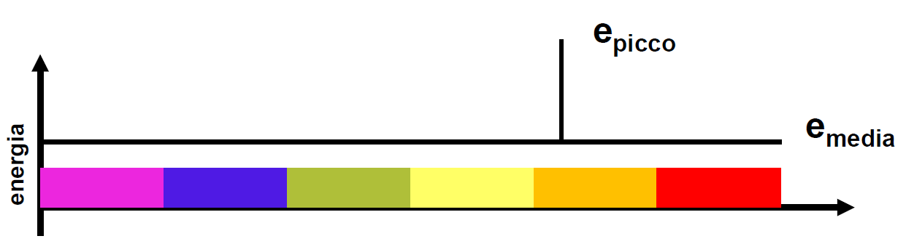
</figure>

Chiameremo la lunghezza d’onda del picco "hue", in italiano "colore
percepito". Il rapporto
$\frac{e\_{picco}- e\_{media}}{e\_{picco} + e\_{media}}$ è detto
"saturazione". La *e**m**e**d**i**a* è proporzionale al
contenuto energetico della radiazione, e da contributo bianco al colore
percepito. Ad ogni colore percepito (hue) coincide un triangolo:  

<figure>
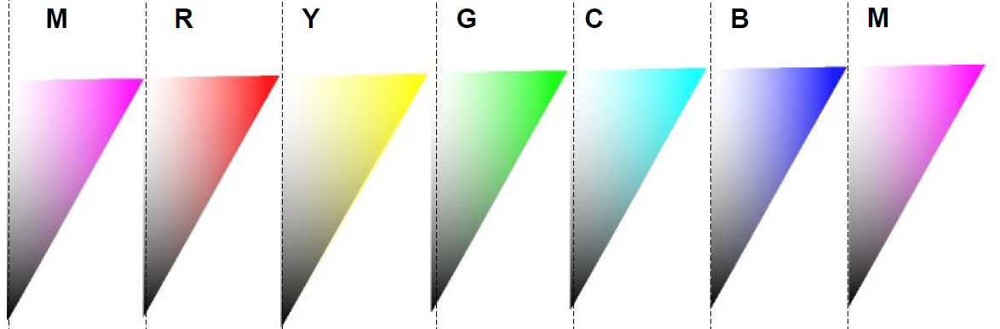
</figure>

Unendo, geometricamente parlando, i triangoli, otterremo lo spazio di
colore *H**S**V*, rappresentato, per l’appunto, da un cono.
$\\ H = hue;\\ \\S = saturazione \\o \\C = chroma ;\\ \\V = valore;$

## Spazi di colore RGB e CMY

### Sintesi additiva

La composizione additiva dei colori è il principio alla base del
funzionamento dei monitor. I colori vengono creati a partire dai tre
"colori primari" rosso, verde e blu. Inoltre, combinando a due a due i
colori, otteniamo giallo, magenta e ciano. Dalla sovrapposizione di
tutti e tre i colori, otteniamo il bianco. Viene replicata illuminando
con tre fasci di luce colorati.

### Sintesi sottrattiva

La sintesi sottrattiva, ottenuta sovrapponendo dei filtri ciano, giallo
e magenta.
*Y* + *M* = *R*; *Y* + *C* = *G*; *M* + *C* = *B*; *Y* + *M* + *C* = *K*

### RGB

Nel modello RGB ogni colore viene ottenuto mischiando i tre colori
fondamentali. Considerando ogni componente come una coordinata
cartesiana, il modello RGB è descrivibile come un cubo. Il suo
complementare è lo spazio di colore CMY.

### 

sectionColori sicuri per il web Il web usa tipicamente 256 colori.
Mentre 40 di questi sono processati diversamente da i vari sistemi
operativi, gli altri 216 sono comuni alla maggior parte di loro, e sono
detti web-safe colors. Il loro esadecimale ha la caratteristica di
essere formato solo da i seguenti numeri: 00, 33, 66, 99, CC, FF.

## Famiglia di spazi di colore YUV

In questo tipo di spazi di colore, utilizzato per la codifica di
immagini o video analogici, i valori di luminanza e crominanza sono
tenuti separati.  
Tra le controparti digitali degli spazi YUV, troviamo gli spazi
*Y**C**b**C**r*.

### Da RGB a YUV

Nel caso in cui R, G e B siano compresi tra 0 e 1, si ottengono valori
di Y compresi tra 0 e 1, e valori di U e V compresi tra -0,5 e 0,5.

### Da YUV a YCbCr

*Y* = 0.299*R* + 0.587*G* + 0.114*B*
*C**b* = *U* + 128
*C**r* = *V* + 128

# Colori e Memoria

Memorizzare le informazioni relative ai colori dei pixel che
compongono  
un’immagine, implicherebbe l’utilizzo di una matrice di dimensioni pari
alla risoluzione, contenenti terne di 8 bit.  
Questo metodo tuttavia è spesso sconveniente, soprattutto per immagini a
pochi colori. Andiamo quindi a introdurre delle alternative.

## Immagini a colori indicizzati

Piuttosto che creare una matrice di terne, andremo a creare una tabella
contenente terne assieme ad un indice univoco associato ad ogni
colore.  
In questo modo, possiamo andare a memorizzare ogni pixel usando memoria
pari 2*n*, con *n* colori. La tabella in questione si chiama
tavolozza o palette.

## Re-indexing

Esistono strategie di compressione applicabili alle matrici degli indici
delle immagini a colori indicizzati.  
Un’immagine a *n* colori avrà *n* indici differenti. Ogni immagine sarà
quindi rappresentabile in *n*! modi (*n*! permutazioni), in quanto ad
ogni terna potremmo associare uno tra gli *n* indici disponibili.
Scegliendo la permutazione ottimale, è possibile ottenere un’entropia
più bassa nell’immagine, permettendo agli algoritmi di compressione di
funzionare nella maniera migliore. Idealmente, la permutazione migliore
associa a indirizzi simili, colori simili.

<figure>
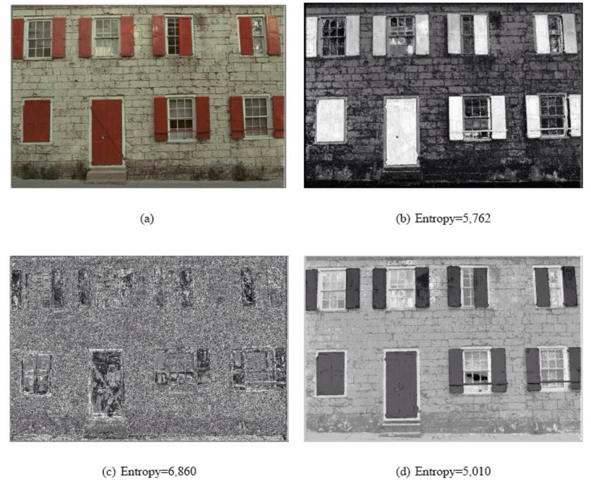
</figure>

# Istogramma

Le immagini sono collezioni di valori numerici. Lavorando con lavori
numerici, è possibile andare a tracciare istogrammi che permettono di
rappresentare le occorrenze di un determinato valore all’interno
dell’immagine. Un’istogramma è implementabile come un vettore di
elementi. Un’istogramma è detto normalizzato quando ogni elemento del
vettore è espresso come $\frac{occorrenze}{occorrenze \\ totali}$

## Caratteristiche dell’immagini

Un’istogramma ordinato permette di capire la distribuzione delle
occorrenze di determinati toni di grigio. L’istogramma di un’immagine
che subisce trasformazioni legate all’ordine dei pixel, rimane
costante.  
Istogramma diverso ⇒ Immagine diversa.  
Tramite gli istogrammi, ad esempio, è possibile intuire se un’immagine è
sovraesposta o sottoesposta.

## Contrast Stretching

È un’operazione che, operando sull’istogramma, permette di ottenere una
distribuzione sull’istogramma che copre l’intero range dei colori.

### Formula di Normalizzazione Lineare

Di seguito, la formula usata dall’operazione di contrast stretching.
\[N.B. non c’entra nulla con la definizione di istogramma normalizzato\]
$$v\_{nuovo} = 255 \cdot \frac{(v\_{vecchio} - min\_{osservato})}{(max\_{osservato} - min\_{osservato})}$$
Che ritorna il valore di *v* nel nuovo range \[0, 255\].

### Contrast stretching su immagini a colori

Ogni immagine a colori avrà tre istogrammi. Effettuare un’operazione di
contrast stretching su un’immagine cui colori non hanno una
distribuzione uniforme e range dinamici tra colori differenti, potrebbe
farci ottenere un’immagine dai colori più naturali.

## Equalizzazione

È un’operazione che attenua le differenze tra occorrenze  
dei pixel di valore diverso. Tende, in un certo senso, ad appiattire
l’istogramma relativo all’immagine.

### Algoritmo di Equalizzazione

Definiamo prima l’istogramma normalizzato:  
*r**k* livello di grigio.  
*L* livello di grigio massimo (esempio: 3 bit = 8).  
*n**k* numero di occorrenze di quel livello di grigio.  
*M* × *N* dimensioni dell’immagine.
$$p_r\[r_k\] = \frac{n_k}{MN} \\\\\\ per \\ k = (0, 1, 2,..., L-1);$$
I nuovi valori di grigio dell’istogramma sono così definiti:
$$s_k = T(r_k) = (L-1) \sum\_{j = 0}^k p_r(r_j) =\frac{(L-1)}{MN}\sum\_{j = 0}^k n_j \\\\\\ per \\ k = (0, 1, 2,..., L-1);$$
A causa della sommatoria sarà sempre il seguente:
*s**L* − 1 = *L* − 1

# Operatori puntuali

## Trasformazioni nel dominio spaziale

Una trasformazione nel dominio spaziale è descritta come:
*g*(*x*, *y*) = *T*\[*f*(*x*, *y*)\]
La dimensione dell’intorno (*x*, *y*) definisce il carattere
dell’elaborazione

-   puntuale (intorno coincide col punto)

-   locale (una piccola regione quadrata centrata sul pixel)

-   globale (intera *f*)

## Cosa sono gli operatori puntuali

### Alcuni operatori puntuali

-   Aggiunta di una costante a tutti i pixel:  
    *g*(*x*, *y*) = *f*(*x*, *y*) + *c*

-   Inversione della scala di grigi (negativo):  
    *g*(*x*, *y*) = 255 − *f*(*x*, *y*)

-   Espansione del contrasto

-   Modifica dell’istogramma

-   Presentazione in falsi colori

### LUT (Look-Up-Table)

Sono delle tabelle che associano ad un valore di *f*(*x*, *y*), il
valore *g*(*x*, *y*) data una trasformazione *T*. Una LUT può anche
essere rappresentata come una funzione in un piano cartesiano.

## Incupimento e schiarimento

Sono degli effetti che possiamo ottenere, agendo sull’immagine con la
trasformazione logaritmica e trasformazione potenza.

### Trasformazione logaritmica

Consente di comprimere la gamma dinamica, è espresso come:
*g*(*x*, *y*) = *c* ⋅ *l**o**g*(1 + *f*(*x*, *y*))
Dove *c* p una costante positiva che serve a normalizzare il risultato
nel range \[0, 255\].  
In un’immagine a 8 bit, i valori sono seguenti:
*f* ∈ \[0, 255\]
1 + *f* ∈ \[1, 256\]
*l**o**g*2(1 + *f*) ∈ \[0, 8\]
$$c = \frac{255}{log_2(1+255)}$$

### Trasformazione potenza (o gamma)

È un’altra trasformazione che consente di comprimere la gamma dinamica,
è espresso come:
*g*(*x*, *y*) = *c* ⋅ (*f*(*x*, *y*))*γ*
Dove *c* p una costante positiva che serve a normalizzare il risultato
nel range \[0, 255\].  
In un’immagine a 8 bit, i valori sono seguenti:
*f* ∈ \[0, 255\]
*f**γ* ∈ \[0, 255*γ*\]
$$c = \frac{255}{255^\gamma} = \frac{1}{255^{\gamma-1}}$$

## Binarizzazione

Viene associato il colore nero a tutti i valori minori di una soglia
*S*, detta threshold; a tutti i valori superiori di *S*, il bianco.

## Alterazione del contrasto

### Aumento del contrasto

Aumenta i toni agli estremi, ampliando l’istogramma verso gli estremi.

### Riduzione del contrasto

Riduce i toni agli estremi, aumenta i toni medi. La distribuzione
sull’istogramma si alzerà al centro e si riddurà agli estremi.

# Operatori Locali

## Alcuni concetti dall’algebra lineare

### Base e base canonica

Dato uno spazio vettoriale, si dirà base un’insieme di vettori
linearmente indipendenti che, per combinazione lineare, generano lo
spazio vettoriale. Chiameremo base canonica dello spazio vettoriale
*R**n*, la base nella forma
*B* = (*e*1, *e*2, ..., *e**n*)
Con
*e*1 = \[1, 0, 0, ..., 0*n*\]
*e*2 = \[0, 1, 0, ..., 0*n*\]
*e**i* = \[01, 02, ..., 1*i*, ..., 0*n*\]
*e**n* = \[0, 0, ..., 1\]

### Operatori Lineari

La funzione *f* : *V* → *W* si dirà lineare se rispetta la seguente
proprietà:
*a* ⋅ *f*(*v*1) + *b* ⋅ *f*(*v*2)
Detta proprietà di linareità.

## Operatori non-invarianti per traslazione

Un’operatore non invariante per traslazione, è un operatore cui
comportamento dipende non solo da elemento a elemento, ma anche dalla
posizione all’interno delle immagini. Operatori lineari, cui valore
dipende dalla *x* e dalla *y*, non sono invarianti per traslazione.
Un’operatore puntuale sarà sempre invariante per traslazione.

### Shift Invariant e Kernel

Un operatore si dice invariante per traslazione se il suo comportamento
su immagini impulsive è il medesimo indipendentemente dalla posizione
del pixel.

#### Riassumendo:

-   Se *f* è lineare, per descriverlo basta conoscere il comportamento
    su tutte le immagini impulsive

-   S *f* è shift invariant, si comporta allo stesso modo su tutti gli
    impulsi, indipendentemente dalla loro posizione

-   Se *f* è sia lineare che shift invariant, per descriverlo basta
    conoscere il suo comportamento su un solo impulso.  
    La "risposta all’impulso" di *f* è la carta d’identità di tale
    operatore. La matrice che descrive la risposta d’inpulso è anche
    detta kernel o maschera di convoluzione di *f*.

### Kernel finiti o infiniti

La grandezza del kernel può variare fino ad essere infinita. Per ragioni
pratiche, tuttavia, vengono usati solo kernel di dimensioni finite.

## La convoluzione

### Filtri convolutivi

Questi filtri sono detti filtri convolutivi, perché operano tramite
convoluzione. Il comportamento della convoluzione dipende dalla
dimensione del Kernel.

### Convoluzione con Kernel finito

$$g\_{m,n} = \sum^{\lceil s/2 \rceil-1}\_{i=- \lfloor s/2 \rfloor}\sum^{\lceil s/2 \rceil-1}\_{j=- \lfloor s/2 \rfloor} (h\_{i,j}\*f\_{m+i, n+j})$$

|     | -1  |  0  |  1  |
|:---:|:---:|:---:|:---:|
| -1  |  a  |  b  |  c  |
|  0  |  d  |  e  |  f  |
|  1  |  g  |  h  |  i  |

### Convoluzione e problema dei bordi

Applicare un filtro locale su un punto, tramite convoluzione, implica il
controllo dei pixel in una determinata area attorno a pixel in
questione: questo può portare a complicazioni quando il pixel su cui
applicare l’effetto è in prossimità dei bordi. Ecco degli approcci al
problema:

-   **Ignorare i bordi.**  
    Otterremo un’immagine di dimensioni minori.

-   **Considerare nulli i pixel esterni.**  
    Daremo un valore  = 0 al valore interessato di tutti gli ipotetici
    pixel out-of-bounds.

-   **Riempire righe e colonne in maniera Toroidale.**  
    Molto efficace su immagini di tessiture (texture). L’immagine
    continua in una sorta di "effetto pac-man"

-   **Riempire con i nearest-neighbour.**  
    Estendo l’immagine con copie delle colonne e delle righe ai bordi
    usando un algoritmo di interpolazione di tipo nearest-neighbour.

# Alcuni operatori sulle immagini

## Operatore mediano

Data una sequenza ordinata di valori, sarà scelto l’elemento a metà
della sequenza (se pari, verrà scelta la media tra i due operatori
mediani) Applicarlo su un’immagine, significa che, dato un pixel *p* e
preso un intorno di dimensione *n* × *n*, e creata la sequenza dei pixel
dell’intorno, *p* sarà uguale al mediano.  
Non è un filtro che si può implementare con la convoluzione. È
invariante per traslazione, ma non è lineare (non è possibile ottenere
il mediano con una somma di prodotti).

### Minimo e Massimo

Analoghi all’operatore mediano, ma la scelta (più veloce
computazionalmente), ricade rispettivamente sul minimo o sul massimo.

### N-Box (o di media)

Dato un kernel di dimensione *N* × *N*, si effettua la somma di tutti i
pixel dell’area del Kernel, e si divide per *N*2.  
È possibile implementarla tramite convoluzione, e il Kernel è il
seguente:
$$Kernel = \frac{1}{N^2} \*
	\begin{bmatrix}
		1 & 1 & 1 \\
		1 & 1 & 1 \\
		1 & 1 & 1 \\
	\end{bmatrix}$$
Uno svantaggio del filtro di media, rispetto a quello mediano, è che
esiste la possibilità in cui vengano introdotti nuovi colori.

### Filtro N-Binomiale (o filtri Gaussiani)

Filtro 3-binomiale:
$$Kernel = \frac{1}{16} \*
	\begin{bmatrix}
		1 & 2 & 1 \\
		2 & 4 & 2 \\
		1 & 2 & 1 \\
	\end{bmatrix}$$
Filtro 5-binomiale:
$$Kernel = \frac{1}{256} \*
	\begin{bmatrix}
		1 & 4  & 6  & 4  & 1 \\
		4 & 16 & 24 & 16 & 4 \\
		6 & 24 & 36 & 24 & 6 \\
		4 & 16 & 24 & 16 & 4 \\
		1 & 4  & 6  & 4  & 1 
	\end{bmatrix}$$
 Derivano dalla distribuzione binomiale (che è una discretizzazione
della distribuzione gaussiana).  
Tutti i valori dell’area del Kernel vengono divisi per la somma dei pesi
totali, e sommati tra loro. Il valore ottenuto sarà sempre uguale a 1:
ciò permetterà di mantenere la media all’interno del range tra il valore
minimo e il valore massimo dell’area del Kernel. Ciò varrà anche per
l’immagine totale, e chiameremo questo tipo di filtro, filtri
conservativi.

## Rumore

Problemi con l’hardware, impostazioni inadeguate

### Noise reduction e smoothing

I filtri precedenti sono anche detti filtri di noise reduction o
smoothing, in quanto permettono di ridurre il rumore.

### Rumore impulsivo (o sale e pepe)

*p*(*z*) è l’intensità di *z*, *P**a* è la probabilita di
*a*, *P**b* è la probabilita di *b*,
$$p(z) = \begin{cases}
	P_a \textit{ per }z=a \\
	P_b \textit{ per }z=b \\
	0 \textit{ altrimenti}
	\end{cases}$$
Se *a* e *b* sono il massimo e il minimo dell’intensità, si ottiene il
vero e proprio rumore sale e pepe.  
Il filtro che si presta meglio a risolvere questo tipo di rumore, è
quello mediano, in quanto escluderà gli estremi. inserisci esempio

### Rumore gaussiano

$$p(z) = \frac{1}{\sqrt{2 \pi \sigma}}e^{-(z-\bar{z})^2/2\sigma^2}$$
*z* è l’intensità, *z̄* è il valore medio di *z* e *σ* è la sua
deviazione standard. *σ*2 è detta varianza di *z*.
approfondisci sulla distribuzione in questione.

### Altri filtri di noise reduction

-   **Olimpico.**  
    Dato un intorno, si eliminano il valore più grande e il più piccolo,
    per poi calcolare la media dei rimanenti.

-   **Outlier.**  
    Il valore del pixel centrale viene confrontato con la media degli 8
    vicini. Se la differenza (il valore assoluto della differenza)
    supera una certa soglia, allora viene sostituito il punto dal valore
    medio, altrimenti viene preservato.

# Estrazione dei Contorni

## Rilevazione degli edge

È un processo che permette di individuare i contorni all’interno di
un’immagine.

### Contorni come discontinuità

Solitamente, un contorno si presenterà in un’immagine come una
variazione importante della della luminanza. Secondo questo principio,
basterebbe individuare le variazioni di luminanza.  
L’operazione di derivata prima (e seconda) ci permetterà di individuare
massimi e minimi all’interno di un segnale mono-dimensionale.

### Derivata prima e seconda

Derivare la funzione di un segnale mono-dimensionale, ci permetterà di
individuare le variazioni di luminanza.  
Con la derivata seconda, otterremo degli zeri nei punti in cui la
derivata prima raggiunge dei punti di massimo e di minimo.

## Sobel e Prewitt - Kernel notevoli

Nelle prossime due sezioni verranno presentati quattro kernel, due per
tipo (Sobel e Prewitt) e 2 per componente (orizzontale e verticale). Il
principio di cui abbiamo parlato precedentemente, funziona su un segnale
mono-dimensionale. Proprio per questo utilizzeremo due Kernel differenti
per le due componenti dell’immagine.

### Lati orizzontali

$$Sobel_x = 
	\begin{bmatrix}
		-1 & -2 & -1 \\
		0  & 0  & 0  \\
		1  & 2  & 1  
	\end{bmatrix}$$
$$Prewitt_x = 
	\begin{bmatrix}
		-1 & -1 & -1 \\
		0  & 0  & 0  \\
		1  & 1  & 1  
	\end{bmatrix}$$
Un filtro del genere non darà come output un’immagine, bensì una matrice
di valori (spesso negativi e/o molto grandi).  
Per convertire la matrice, andremo a effettuare il valore assoluto di
tutti i valori della matrice, per poi normalizzare il range della
matrice.

### Lati verticali

$$Sobel_y = 
	\begin{bmatrix}
		-1 & 0 & 1 \\
		-2 & 0 & 2 \\
		-1 & 0 & 1 
	\end{bmatrix}$$
$$Prewitt_y = 
	\begin{bmatrix}
		-1 & 0 & 1 \\
		-1 & 0 & 1 \\
		-1 & 0 & 1 
	\end{bmatrix}$$

### Magnitudo

È possibile combinare le due matrici con la formula del modulo (radice
della somma dei quadrati).
$$magnitudo = \sqrt{sobel_x^2 + sobel_y^2}$$
La matrice ottenuta conterrà valori non nulli per i pixel "di lato".
Fissare una soglia adeguata ci permette di ottenere una matrice che
contenga con più o meno precisione, la posizione dei pixel di contorno.

### Laplaciano - Kernel Notevoli

Un operatore basato sullo stesso principio della derivata seconda, per
la rilevazione dei contorni, è il Laplaciano (Laplasiano).
$$Laplaciano = \begin{bmatrix}
	-1 & 0 & -1\\
	0 & 4 & 0\\
	-1 & 0 & -1\\
	\end{bmatrix}$$

#### Condizione di Zero-Crossing

Rispetto al punto *p* analizzato, per poter essere un edge, deve essere
sempre presente un valore positivo e un valore negativo in un suo
intorno (in una direzione verticale, orizzontale o obliqua).

## Filtro di Sharpening

Un altro Kernel interessante è quello di un filtro di Sharpening.
$$Sharpening = \begin{bmatrix}
	-1 & 0 & -1\\
	0 & 5 & 0\\
	-1 & 0 & -1\\
	\end{bmatrix}$$
È ottenuto dalla somma del Laplaciano + il kernel identità
$\begin{bmatrix}
	0 & 0 & 0\\
	0 & 1 & 0\\
	0 & 0 & 0
	\end{bmatrix}$.  
In tal modo, avremo un intensità di luminanza maggiore in corrispondenza
dei bordi, applicata alla foto originale.

# Bit-plane

## Introduzione ai Bit-Plane

Un’immagine con una profondità di colore a *n* bit può essere
rappresentata da *n* piani di bit (bit-planes): ciascuno di questi piani
può essere visto come un’immagine binaria. Ad ogni cifra binaria
contenuta nei pixel dell’immagine, coinciderà un’immagine binaria.  
Esempio su profondità di colore a 3 bit:
$$\begin{bmatrix}
		001 & 011 \\
		110 & 001 
	\end{bmatrix}$$
Otteniamo 3 bit planes:

$2:
		\begin{bmatrix}
			0 & 0 \\
			1 & 0 
		\end{bmatrix}$$\\\\\\1:
		\begin{bmatrix}
			0 & 1 \\
			1 & 0 
		\end{bmatrix}$$\\\\\\0:
		\begin{bmatrix}
			1 & 1 \\
			0 & 1 
		\end{bmatrix}$

## Bit-plane binario puro

Fino ad ora abbiamo parlato di bit-plane codificati in binario puro.  
Per binario puro, intendiamo la codifica che coincide al sistema
numerico binario che già conosciamo.  
L’utilizzo del sistema binario puro nel contesto dei bit-planes è molto
utile (come vedremo nel prossimo paragrafo), ma ha un grande svantaggio,
di cui parleremo successivamente.

### Bit-planes più e meno significativi

I bit meno significativi sono i responsabili delle piccole variazioni di
colore all’interno delle immagini. Ciò vale anche per i bit-planes meno
significativi, che conterranno proprio informazioni relative a rumore
gaussiano e piccole variazioni di colore.  
I bit-planes più significativi saranno quelli più simili all’immagine
originale.  
Detto ciò, suddividere in bit-planes un’immagine ci permetterà di
studiarne i dettagli, rilevando modifiche sull’immagine (vedere pattern
anomali del rumore gaussiano sul bit-plane meno significativo denota
modifiche effettuate sull’immagine)

<figure>
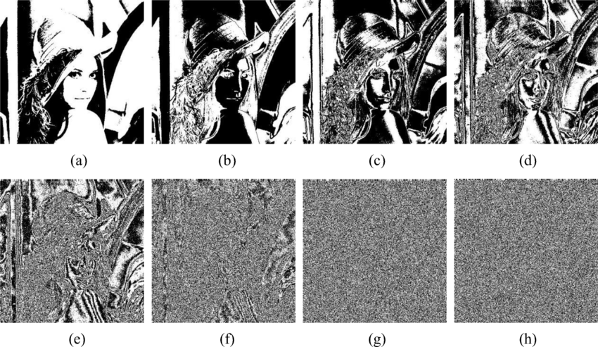
</figure>

Il bit-plane più significativo può essere ottenuto tramite una
sogliatura (o binarizzazione) con *S* = 2*n* − 1.

### Bit-plane - problema

Un problema relativo alla rappresentazione in binario puro, è la
seguente: due valori di grigio molto simili possono avere codifiche
estremamente diverse: 127 (01111111) e 128 (10000000). La transizione
tra 127 e 128 si ripercuote su tutti i piani, nonostante le piccoli
differenze, creando quindi dei bit-planes non molto coerenti tra loro. A
fini di compressione, serve una codifica che associa a valori simili,
codifica simile.

## Codifica gray

A valori successivi tra loro, devono essere associate parole di bit che
si differenziano di al più un bit, o, in altre parole, la distanza di
hamming[^1] tra un colore e il suo successivo (*n* e *n* + 1) deve
essere uguale a 1.

### Algoritmo per creare codifica gray

Il codice gray a *m* bit
*g**m* − 1...*g*1*g*0 che corrisponde
al numero in binario puro
*a**m* − 1...*a*1*a*0, può essere
calcolato con questa formula:
*g**m* − 1 = *a**m* − 1
*g**i* = *a**i* *X**O**R* *a**i* + 1 0 ≤ *i* ≤ *m* − 2

#### Esempio di Gray code

|     | Binario Puro | Gray code |
|:---:|:------------:|:---------:|
|  0  |     000      |    000    |
|  1  |     001      |    001    |
|  2  |     010      |    011    |
|  3  |     011      |    010    |
|  4  |     100      |    110    |
|  5  |     101      |    111    |

| *a*2 | *a*1 | *a*0 | *g*2 | *g*1 | *g*0 |
|:--:|:--:|:--:|:--:|:--:|:--:|
| 0 | 0 | 0 | 0 | 0 | 0 |
| 0 | 0 | 1 | 0 | 0 | 1 |
| 0 | 1 | 0 | 0 | 1 | 1 |
| 0 | 1 | 1 | 0 | 1 | 0 |

E quindi, 127 e 128 diventeranno:
127 = 0111111 → 01000000
128 = 10000000 → 11000000

### Conseguenze visibili sui bit-planes in gray code

La codifica gray aumenta la coerenza tra le codifiche dei valori di
grigio. Questo ci permetterà di distinguere le figure a partire da
bit-plane meno significativi, se messi a confronto con quelli in binario
puro.

### Vantaggi relativi alla compressione di bit-planes gray code

Essendo una codifica più coerente, la codifica gray aumenterà la
ridondanza, permettendo di comprimere più facilmente le immagini.

<figure>
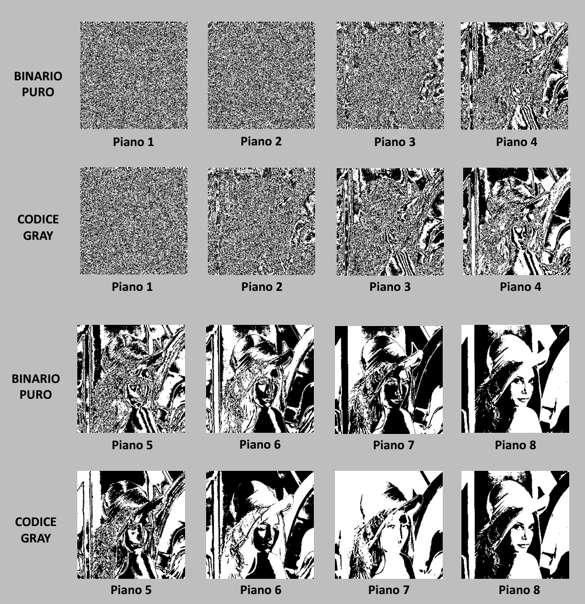
</figure>

# Dominio delle Frequenze - Serie di Fourier

## Il teorema di Fourier

Il teorema di Fourier afferma che qualsiasi segnale periodico può essere
rappresentato come somma di funzioni seno e coseno (serie di Fourier),
con differenti frequenze e ampiezze. Con la trasformata di Fourier, è
possibile esprimere in tal modo anche segnali non periodici.  
Convertire un segnale nel cosiddetto "dominio di Fourier" è un processo
sempre reversibile grazie all’anti-trasformata di Fourier". Ci
permetterà quindi di operare sul segnale all’interno del dominio delle
frequenze, per poi ricostruire un segnale nel dominio originale.

### La trasformata di Fourier applicata alle immagini

L’idea della trasformata di Fourier, è quella di rappresentare
l’immagine in un altro spazio di funzioni, passando da un dominio
spaziale, a un dominio delle frequenze. Un’immagine può essere vista
come una funzione **discreta** in due dimensioni i cui valori
rappresentano il livello di grigio di un determinato pixel. La funzione
immagine potrebbe essere vista come una funzione variabile in un dominio
con una propria frequenza. Sappiamo inoltre che è possibile
rappresentare un’immagine come combinazione lineare di basi canoniche.
Con la trasformata discreta di Fourier, otteniamo una combinazione
lineare di funzioni seno e coseno, con coefficenti pari a
*c*1, *c*2, …, *c**n*. Il contributo
della *n*-esima frequenza è direttamente proporzionale al valore di
*c**n*.

### Formule della trasformata discreta di Fourier

Lavorando con segnali digitalizzati, e quindi discretizzati, andremo a
lavorare in termini di sommatorie e non di integrali, avvalendoci così
della trasformata **discreta** di Fourier. Di seguito, le formule
relative alla trasformata.

#### Trasformata della funzione f(x,y)

$$F(u,v) = \frac{1}{MN}\sum\_{x=0}^{M-1}\sum\_{y=0}^{N-1}f(x,y)e^{-i2 \pi (\frac{u}{M}x+ \frac{v}{N}y)}$$
per *u* = 0, 1, …, *M* − 1 e *v* = 0, 1, …, *N* − 1

#### Antitrasformata della funzione F(u,v)

$$f(x,y) = \sum\_{x=0}^{M-1}\sum\_{y=0}^{N-1}F(u,v)e^{i2 \pi (\frac{u}{M}x+ \frac{v}{N}y)}$$
per *x* = 0, 1, …, *M* − 1 e *y* = 0, 1, …, *N* − 1

#### Formula di Eulero

Apparentemente questa sommatoria non contiene nè il seno, nè il
coseno.  
Rimembriamo quindi la formula di Eulero, per cui, per ogni numero reale
*x* si ha:
*e**i**x* = cos *x* + *i*sin *x*
E quindi
*e*−*i**x* = cos *x* − *i*sin *x*

#### Spettro della trasformata

$$\|F(u,v)\| = \sqrt{R^2(u,v)+I^2(u,v)}$$

#### Angolo di Fase

$$\phi(u,v) = \tan^{-1}\left\[\frac{I(u,v)}{R(u,v)}\right\]$$
Ricorda, il $\lim\_{x \to +\infty} \arctan{x}= \frac{\pi}{2}$.

#### Potenza Spettrale

*P*(*u*, *v*) = \|*F*(*u*, *v*)\|2 = *R*2(*u*, *v*) + *I*2(*u*, *v*)

### Range dinamico

Applicata la trasformata di Fourier su un’immagine, andremo a ottenere
un range di valori molto ampio. Molti valori molto piccoli, pochi numeri
molto grandi, nell’ordine dei miliardi. Per visualizzare lo spettro
senza anomalie, sfruttiamo la trasformazione logaritmo puntuale,
piuttosto che una normalizzazione standard, ovvero:
*D*(*u*, *v*) = *c* ⋅ log (1 + *F*(*u*, *v*))

### Vantaggi della trasformata di Fourier

Nel dominio spaziale, le coordinate fanno riferimento ad un pixel nella
posizione data dalla coordinata.  
Nello spazio delle frequenze, le coordinate esprimono una determinata
frequenza e il suo contributo. In questo modo, possiamo andare a
sopprimere frequenze indesiderate o eliminare informazioni superflue per
comprimere in maniera lossy. Inoltre, dallo spettro della trasformata e
dall’angolo di fase, è possibile analizzare degli elementi relativi
all’immagine originale:

-   Dallo spettro della trasformata, è possibile capire se sono presenti
    pattern ripetuti (strutture periodiche) all’interno dell’immagine
    originale.

-   All’interno della fase, troviamo informazioni relative alla
    posizione delle strutture periodiche in questione.

### Operare sullo spettro

I contributi dalle basse frequenze si troveranno quindi al centro
dell’immagine, le alte frequenze si troveranno all’esterno.  
Con opportuni filtri, che introdurremo successivamente, sarà possibile
migliorare l’immagine operando proprio nel dominio delle frequenze, e
sopprimendo determinate frequenze (rimuovendo anche pattern ripetuti
indesiderati!).

### Proprietà della trasformata di Fourier

#### Separabilità

La trasformata di Fourier discreta può essere espressa in forma
separabile. È possibile andare a separare le due dimensioni, lavorandoci
separatamente.

#### Traslazione

Operazioni di traslazione (non rotazione!) sull’immagine nel dominio
spaziale non alterano lo spettro.  
Inoltre, solo nello spettro, è possibile andare a effettuare una scambio
tra il primo e il terzo quadrante , e il primo e il secondo, per
visualizzare al centro le basse frequenze, e ai bordi le alte, dando
un’immagine più semplice da analizzare ad occhio.

#### Valore continuo

Il valore medio (o valore continuo) è il valore di *F*(0, 0).

### Fast Fourier Transform

Esiste un’algoritmo per la trasformata di Fourier, di complessità
*Θ*(*n*log *n*). A causa della doppia sommatoria, la complessità della
formula classica è *n*2. Non lo studieremo, ma è buono sapere
che esista.

### Frequenze

All’interno delle immagini, le frequenze sono legate alla velocità di
variazione dei toni. Per questo motivo, le basse frequenze sono quelle
legate al tono generale dell’immagine, mentre le alte frequenze
contengono informazioni relative a variazioni molto veloci, come nel
caso del rumore.

## Teorema della convoluzione

La trasformata della convoluzione di due segnali nel dominio spaziale
equivale al prodotto delle trasformate dei due segnali.  
Ciò significa anche che la convoluzione di due segnali nel dominio
spaziale equivale all’antitrasformata del prodotto delle trasformate di
due segnali.
*F*(*f* ⊗ *h*) = *F*(*f*) ⋅ *F*(*h*)
Con *f* immagine, *h* kernel, ⊗ convoluzione, *F* trasformata di
Fourier.  
Applicare questo metodo nel dominio di frequenze ha complessità
*O*(*n**l**o**g**n*).

### Conseguenza di questo teorema

Questo teorema è importantissimo, in quanto ci permette di applicare
filtri convolutivi senza utilizzare la convoluzione (un’operazione
notoriamente lenta!).  
Basterà infatti:

1.  Adattare il kernel alla dimensione e forma dell’immagine su cui
    andrà applicato, aggiungendo zeri in maniera opportuna.

2.  Trasformare l’immagine da modificare e il kernel (passaggio non
    richiesto quando si lavora con i filtri Guassiani)

3.  Effettuare il prodotto puntuale tra le trasformata dell’immagine e
    quella del Kernel.

4.  Calcolare l’antitrasformata di Fourier dell’immagine ottenuta dal
    prodotto puntuale, per tornare nel dominio spaziale.

## Filtri passa basso / passa alto

Introduciamo adesso una serie di filtri utilizzabili nel dominio delle
frequenze per ridurre o eliminare del tutto determinati range di
frequenze.

### Low pass ideale

$$H(u,v) = \begin{cases}
	1 \\se \\D(u,v) \leq D_0\\
	0 \\se \\D(u,v) \> D_0\\
	\end{cases}$$
Dove *D*(*u*, *v*) è la distanza dal centro.
$$D(u,v) = \sqrt{\[(u-M/2)^2 + (v-N/2)^2\]}$$
Il filtro in questione preserverà le differenze all’interno del cerchio
di raggio *D*0.

#### Conseguenze della delta di Dirac

A causa della forma delta di dirac, un taglio netto come quello del
low-pass ideale (e degli altri filtri sulle bande ideali) genererà degli
artefatti in prossimità dei bordi.

### Low-pass di Butterworth

$$H(u,v) = \frac{1}{1+\left\[ \frac{D(u,v)}{D_0}\right\]^{2n}}$$
Il valore *n* è l’ordine del filtro di Butterworth, e indica la pendenza
del taglio. Il filtro in questione, non genera gli stessi artefatti di
quello ideale, offrendo risultati molto migliori. Il valore di
*H*(*u*, *v*) sarà sempre incluso tra 0 e 1.

### Filtro low-pass Gaussiano

$$H(u,v) = e^{-\left\[\frac{D(u,v)}{2D_0}\right\]^2}$$
La trasformata di Fourier di una funzione gaussiana, è sempre la
funzione stessa. Non c’è bisogno di effettuare la trasformata del filtro
gaussiano. È possibile fare direttamente il prodotto puntuale tra la
trasformata dell’immagine e il filtro.

### Filtro High-pass ideale

$$H(u,v) = \begin{cases}
	0 \\se \\D(u,v) \leq D_0\\
	1 \\se \\D(u,v) \> D_0\\
	\end{cases}$$
Questo filtro conserverà i dettagli. Il suo funzionamento è
perfettamente analogo a quello low-pass, ma con un inversione di 0 e 1.

### High-pass di Butterworth

$$H(u,v) = \frac{1}{1+\left\[ \frac{D_0}{D(u,v)}\right\]^{2n}}$$
Il valore *n* è l’ordine del filtro di Butterworth, e indica la pendenza
del taglio. Il filtro in questione, non genera gli stessi artefatti,
offre risultati molto migliori. Il valore di *H*(*u*, *v*) sarà sempre
incluso tra 0 e 1.

### Filtro Gaussiano

$$H(u,v) = 1-e^{-\left\[\frac{D(u,v)}{2D_0}\right\]^2}$$
La trasformata di Fourier di una funzione gaussiana, è sempre una
funzione gaussiana.

### Filtro band reject ideale

$$H(u,v) = \begin{cases}
	0 \\se \\D_0 - \frac{W}{2}\leq D(u,v) \leq D_0 + \frac{W}{2}\\
	altrimenti \\1
	\end{cases}$$
Con *D*0 frequenza di taglio e *W* dimensione del taglio.

### Filtro band reject di Butterworth

$$H(u,v) = \frac{1}{1+\left\[ \frac{D(u,v)W}{D^2(u,v)-D_0^2}\right\]^{2n}}$$
Con *D*0 frequenza di taglio, *W* dimensione del taglio e *n*
ordine del filtro.

### Filtro band reject di Gaussiano

$$H(u,v) = 1-e^{-\left\[ \frac{D^2(u,v)-D^2_0}{D(u,v)W}\right\]^2}$$
Con *D*0 frequenza di taglio, *W* dimensione del taglio e *n*
ordine del filtro.

## Applicazione dei filtri low e high pass

I filtri band reject ci permettono di rimuovere determinate frequenze.
In questo modo, è possibile rimuovere determinati pattern ripetuti.
Chiaramente va scelta un’opportuna frequenza di taglio. Eliminare questi
dettagli con un’operazione nel dominio spaziale diventa pressocché
impossibile (se non con l’antitrasformata del filtro gaussiano +
convoluzione).

# Compressione

## Introduzione alla compressione

Definiamo la compressione come la rielaborazione dei dati da
rappresentare, col fine di ridurre le dimensioni in termini di memoria.
Le varie strategie di compressione che conosciamo, sfruttano strategie
differenti

### Approcci alla compressione

-   **Sfruttare le ridondanze tra i dati**  
    Riducendo il numero di bit usato per rappresentare in memoria
    sequenze di dati ridondanti, preservando tuttavia tutte le
    informazioni (lossless).

-   **Eliminare dati "trascurabili"  
    ** Sfruttando informazioni relative alla percezione del media, è
    possibile comprimere i file ad hoc. Ad esempio, nei file audio è
    possibile tagliare estremi di banda. Ci sarà quindi una perdita di
    dati (lossy) accuratamente scelti per ridurre al minimo le
    differenze percettive. Non applicabile su testi.

### Cos’è un codice

Un codice è un sistema di simboli utilizzati per rappresentare una certa
quantità di informazioni.  
Ad ogni pezzo di informazioni e a ogni evento coincide una sequenza di
simboli codificati, chiamata codeword, di lunghezza variabile.

### Encoder e Decoder

Il processo di compressione e decompressione implica l’ausilio di un
encoder, per effettuare la compressione, e di un decoder, per
decomprimere il file.  
Il file in entrata all’encoder e in uscita al decoder, sarà diverso nel
caso della compressione lossy, uguale nella compressione lossless.  
La compressione lossy è chiaramente non reversibile.

## Compressione lossless

La compressione lossless si basa sulla rimozione della ridondanza, senza
perdite di dati veri e propri.  
Tuttavia, esiste un limite teorico sotto cui la compressione lossless
non può andare, ed è espresso dal teorema di Shannon per la
compressione, trattato in un paragrafo successivo.

### Frequenza

Data una sequenza *S* di *N* caratteri tratti da un alfabeto di *M*
possibili caratteri (*a*1, …, *a**m*).
$$f_i = \frac{\text{numero di occorrenze di $a_i$}}{N}$$

### Entropia

Definiamo entropia *E* della sequenza di dati *S* la quantità media di
informazione associata alla singola generazione di un simbolo nella
sequenza *S*.
*E* = −∑*i* ∈ *S**f**i**l**o**g*2(*f**i*)
Breve esempio sulla stringa ’AABBAACB’.
$$E = -(\frac{4}{8}\log_2(\frac{4}{8}) + \frac{3}{8}\log_2(\frac{3}{8})+\frac{1}{8}\log_2(\frac{1}{8}))$$
L’entropia è anche chiamata informazione media, e indica il numeri di
bit medi utilizzato per rappresentare un carattere della sequenza.
Intuiamo che *N* ⋅ *E* è il limite teorico della compressione lossless,
ovvero il numero minimo di bit utilizzabile per comprimere la stringa.

#### Teorema del cambio di base

$$log_a(b) = \frac{log_c(b)}{log_c(a)}$$
Potrebbe servire in futuro.

### Teorema di Shannon (per la compressione)

Per una sorgente discreata e a memoria zero, il bitrate minimo è pari
all’entropia della sorgente. I dati possono essere rappresentati senza
perdere informazione (lossless) usando almeno un numero di bit pari a
*N* ⋅ *E*

#### Sorgente discreta?

Una sorgente discreta implica che i possibili caratteri sono in quantità
finita, come in un alfabeto o nella codifica di un’immagine. La sorgente
deve essere discreta, ma nell’ambito del digitale è sempre così, quindi
nulla di cui preoccuparsi realisticamente.

#### Memoria zero?

Stringhe a memoria zero, sono costituite da simboli indipendenti tra
loro. In dati non a memoria zero, questa dipendenza tra i simboli
implica che la probabilità che un simbolo si presenti nella stringa,
aumenta o diminuisce in funzione di altri simboli.

### Codifica di Huffman

Si tratta di una codifica a lunghezza variabile che associa a simboli
meno frequenti codeword (codici) più lunghe e viceversa.  
In questa codifica, nessuna codeword è prefisso di altre codeword. In
questo modo, la decodifica è garantita come univoca, non ambigua. Questa
codifica tenderà al limite imposto dal teorema di Shannon.

#### Come funziona?

1.  Viene creato un albero binario bilanciato

2.  Al termine delle iterazioni la radice avrà peso 1

3.  Si etichetteranno i rami a sinistra con codice 1 e quelli a destra
    con codice 0 (o viceversa)

4.  Il codice che si forma procedendo dalla radice alla foglia è il
    codice abbinato al carattere presente nella foglia stessa

#### Esempio di Codifica di Huffman

*D**a**t**i*: ′*A**A**B**A**B**C**A**A**C**A**A**A**D**D**D**D*′

1.  Questi nodi contengono i simboli e la loro frequenza all’interno del
    testo.

2.  Rendo, due nodi di frequenza più bassa, figli di un nuovo nodo di
    frequenza uguale alla somma dei figli, che chiamerò *α*.

3.  Continuo iterativamente, creo un nodo *β* che ha per figli *α* e
    *D*.

4.  Un’ultima volta.

5.  Ecco il nostro albero di Huffman, completo di archi 0 e 1! I codici
    delle foglie andranno letti dal basso verso l’alto.

    *A* : 1;  *B* : 011;  *C* : 010;  *D* : 00

#### Implicazioni della codifica di Huffman

Per decodificare il file, bisogna avere una struttura dati contenente,
appunto, la associazione stringa-simbolo della decodifica scelta.

### Altri algoritmi di compressione lossless

-   **Run-Length-Encoding.**  
    Si basa sul comprimere una sequenza di bit (0 e 1) esprimendola in
    termini di numeri che indicano il numero di volte in cui si presenta
    1, poi 0, poi 1, poi 0, poi …. Non è una codifica sempre
    vantaggiosa, ma nel caso in cui le sequenze di caratteri uguali sono
    molto lunghe, è il miglior modo per procedere. Agendo direttamente
    su i bit-planes, è un buon algoritmo.

-   **Codifica "differenziale".**  
    Per memorizzare una successione di valori, ad esempio numerici,  
    potremmo memorizzare tutti i singoli elementi di questa successione.
    In alternativa, con la codifica differenziale, possiamo memorizzare
    il primo termine, poi la differenza tra il primo e il secondo, poi
    il secondo e il terzo, e così via.
    134, 137, 135, 128, … → (134) − 3, +2, −7, …
    Come nella buona parte dei casi, usare questa codifica in
    combinazione con Huffman ci da ottimi risultati. La sequenza della
    codifica differenziale di una sequenza di numeri ha entropia più
    bassa dell’originale, aumentando l’efficacia di Huffman.  
    In generale, è sempre meglio si presentino elementi ridondanti per
    applicare compressioni di questo tipo.

## La compressione lossy

La compressione lossy, come abbiamo già detto, implica la perdita di
informazioni all’interno dei dati da comprimere. Tuttavia,
l’informazione scelta per l’eliminazione, se fatta con buon criterio, ci
permette di ottenere dati percepiti in maniera pressocché identica alla
loro controparte originale. Eliminare alcuni bit-plane meno
significativi nelle immagini, rimuovere nell’audio estremi di banda
negli audio.  
Il PSNR ci offrirà informazioni utili legati alla qualità di un
algoritmo di compressione lossy.  
In questo capitolo introdurremo adesso due algoritmi specifici per le
immagini.

### Requantization

Si tratta di una riduzione del numero di livelli di colore disponibili.
In questo modo, andremo a risparmiare numero di bit dedicati a ciascun
canale (RGB). Tuttavia, non sempre riquantizzare offre ottimi risultati.

## JPEG

### Introduzione al JPEG

È l’acronimo di "Joint Photographic Experts Group", ed è dal 1992 ad
oggi attualmente considerato uno standard ISO (per quanto in teoria non
lo sia). È basato sulla DCT (Discrete Cosine Transform).  
È attualmente uno dei formati più importanti e usati di sempre.

### Passi fondamentali della codifica JPEG

1.  Pre-processing:

    1.  Color Transform
        (*R**G**B* → *Y**C**b**C**r*)

    2.  Sottocampionamento della crominanza

    3.  Suddivisione della immagine in sottoimmagini

2.  Trasformazione:

    1.  Discrete Cosine Transform

    2.  Quantization

3.  Codifica:

    1.  DC ((0, 0)) Coefficient Encoding

    2.  Zig-zag ordering of AC Coefficients

    3.  Entropy Coding (Huffman)

## Jpeg step-by-step

### Pre-Processing

#### Passare a YCbCr

Il primo passaggio è una semplice conversione allo spazio di colore
*Y**C**b**C**r*, per separare le informazioni di
luminanza rispetto a quelle di crominanza
$$\begin{bmatrix}
		Y   \\
		C_b \\
		C_r 
	\end{bmatrix}
	=
	\begin{bmatrix}
		0.299 & 0.587  & 0.114  \\
		0.596 & -0.275 & -0.321 \\
		0.212 & -0.523 & 0.311  
	\end{bmatrix}
	\begin{bmatrix}
		R \\
		G \\
		B 
	\end{bmatrix}$$

#### Sottocampionamento della crominanza

I canali della crominanza sono meno importanti di quelli della
luminanza, quindi, in questo step, si andrà a sottocampionare le
informazioni relative ai canali *C**b* e *C**r*,
dimezzandone le dimensioni. In questo modo, a ogni 4 pixel di *Y*
corrisponde un pixel in *C**b* e *C**r*.  
Questo è il primo passaggio lossy (e irreversibile) dell’algoritmo!

#### Suddivisione in sottoimmagini

Le immagini vengono suddivise in blocchi 8 × 8.  
In questo modo verranno ottenute sotto-immagini dall’entropia minore e
su cui sarà più semplice lavorare (considerandone anche le
dimensioni).  
Ognuno di questi quadrotti 8 × 8 sarà processati in maniera differente,
ed è questo il motivo dietro al tipico artefatto a quadretti del JPEG.  
La quadrettatura è proporzionale alla compressione.

### Trasformazione

#### Passaggio preliminare - Shift dei livelli di grigio

Prima dell’applicazione della DCT, a ciascun pixel di ogni blocco viene
sottratto un quantitativo pari a 2*n* − 1, dove *n* è il
numero di bit dedicato a ciascun canale
(*Y**C**b**C**r*).  
In questo modo, il valore medio di grigio 128 diventerà 0, facilitando
così alcuni prossimi passaggi.

#### DCT

Applichiamo la trasformata discreta del coseno ai 64 pixel
dell’immagine.  
All’interno dei blocchi 8 × 8, prima della DCT, i valori presenteranno
correlazioni tra loro: la trasformata del coseno permetterà di ottenere
valori non correlati tra loro (dimostrato statisticamente!), ottenendo
dati a memoria zero[^2].
$$F(u,v) = \frac{2}{N}\left\[\sum^{N-1}\_{x=0}\sum^{N-1}\_{y=0}C(u)C(v)f(x,y)\cos\frac{(2x+1)u\pi}{2\cdot N}\cos\frac{(2y+1)v\pi}{2\cdot N} \right\]$$
$$f(x,y) = \frac{2}{N}\left\[\sum^{N-1}\_{u=0}\sum^{N-1}\_{v=0}C(u)C(v)F(u,v)\cos\frac{(2x+1)u\pi}{2\cdot N}\cos\frac{(2y+1)v\pi}{2\cdot N} \right\]$$
In cui:
$$C(u) = \frac{1}{\sqrt{2}} \text{ per } u=0; \\C(u) = 1 \text{ altrimenti}$$
$$C(v) = \frac{1}{\sqrt{2}} \text{ per } v=0; \\C(v) = 1 \text{ altrimenti}$$
In un blocco 8 × 8, a ogni coefficiente della matrice corrisponderà una
base differente. Applicata la DCT, ci sarà possibile individure il
coefficiente DC, ovvero l’elemento di coordinate (0, 0). Gli altri
coefficienti saranno detti AC.  
Ricordiamo che tramite la DCT, ci sposteremo sul dominio delle
frequenze. Le basi ottenute con la DCT coincidono a varie combinazioni
di frequenze lungo le due dimensioni.

<figure>
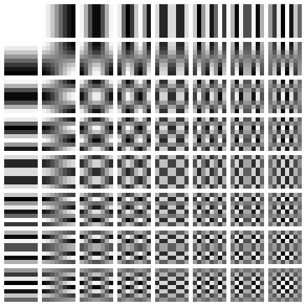
<figcaption>Le basi ottenute con la DCT</figcaption>
</figure>

#### Quantizzazione

*F**q**u**a**n**t**i**z**z**a**t**o* = *r**o**u**n**d*(*F*/*Q*)
La quantizzazione è irreversibile, e avviene arrotondando i valori della
divisione tra i valori di *F* e quelli di *Q*. La *Q* è detta matrice di
quantizzazione, e sarà differente tra il canale *Y* e i canali
*C**b*, *C**r*.  
La perdita delle informazioni è causata dall’arrotondamento, che rende
irreversibile ottenere valori che divisi per *Q* ritornano valori non
interi.  
La matrice *Q* dipende da un quality factor *Q**F* che va da 1 a 100, e
dalle matrici adottate da i produttori dei software / dispositivi di
processing / ricezione dell’immagine.  
Il quality factor è inversamente proporzionale alla quantizzazione.

### Codifica

#### Zig-Zag ordering

Per applicare una codifica run-length, e preservare la coerenza tra i
coefficienti vicini, andremo a linearizzare ogni blocco 8 × 8 con un
ordinamento a zig-zag.  
Questo ordinamento a serpentina favorisce la creazione di lunghe
sequenze continue di zeri.

#### Codifica coefficienti DC

I coefficienti DC, vengono codificati con una codifica differenziale, in
quanto, presumibilmente, a DC di blocchi adiacenti saranno associati
valori abbastanza simili.

#### Codifica coefficienti AC

I coefficienti AC, a differenza di quelli DC, vengono codificati
all’interno del proprio blocco, ogni blocco indipendente dagli altri. Si
è notato che, linearizzando i blocchi 8 × 8 a zig-zag, si ottiene una
sequenza di valori che presentano con numerose sotto-sequenze di zeri.  
Si è deciso quindi di usare una codifica run-length skip value, in cui
ogni valore viene codificato nel sequente modo:
(numero di 0 subito precedenti al numero *n* ≠ 0; *n* ≠ 0)

#### Huffman

Viene usata successivamente una codifica di Huffman sulle differenze
della codifica differenziale su DC e sui valori dei coefficienti AC.

#### Huffman sui DC

Sui valori continui DC, le differenze sono raggruppate in categorie.
Indichieremo con *Δ* la differenza e con *S**S**S**S* la categoria. A
ogni codice *S**S**S**S* è associato un codice base. Una volta fatto ciò

-   Con *Δ* \> 0, i bit da aggiungere sono gli *n* bit meno
    significativi del valore *Δ* in binario

-   Con *Δ* \< 0, i bit da aggiungere sono gli *n* bit meno
    significativi del valore *Δ* in binario con complemento a due[^3],
    ai quali occorre sottrarre il valore 1.

-   Con *Δ* = 0 siamo in un caso banale e la codifica rimane quella
    della tabella in *S**S**S**S* = 0, ovvero 010.

N.B., le cifre sono aggiunte a destra rispetto al codice base.

#### Huffman sugli AC

Viene utilizzato un metodo simile.  
Una tabella associa ai valori dei coefficienti AC una categoria
*S**S**S**S* che dipende dal valore *v* della coppia (0, *v*). Nella
codifica run-length gli eventi sono espressi come coppie (run,
categoria), dove run è la lunghezza della sequenza di zeri, e categoria
è il valore di *S**S**S**S* del valore.

-   Se *v* \> 0 i bit da aggiungere sono i bit meno significativi del
    valore *v* in binario

-   Se *v* \< 0 i bit da aggiungere sono i bit meno significativi del
    valore in binario di *v* con complemento a due ai quali occorre
    sottrarre il valore 1.

Inoltre, la tabella che associa (run,category) ai codici base, contiene
anche la coppia (0, 0), alla quale associa il codice 1010 = *E**O**B*,
ovvero End of Block, fine del blocco. Indica la presenza del numero zero
fino alla fine del blocco contenente i valori AC.

## La ricostruzione delle immagini

Si deve tornare indietro ricostruendo i dati originali (o le loro
approssimazioni per i passi irreversibili).  
Esistono varie strategie di ricostruzione dell’immagine, ma non le
tratteremo nel corso.

### JPEG: Input e Output a confronto

I blocchi ottenuti saranno differenti tra input e output. La differenza
è inversamente proporzionale al quality factor.

### JPEG su immagini grafiche

Dove sono presenti salti di colore importanti, come all’interno di
immagini grafiche, JPEG tende a creare artefatti e colori non presenti
molto evidenti all’interno delle immagini.  
Inoltre, JPEG non supporta il canale alfa, ovvero quello della
trasparenza.

## JPEG 2000

Sostituisce la DCT con le wavelets.  
Alloca più bit nelle zone con più informazioni e permette il controllo
esplicito di tale allocazione.  
Raggiunge rapporti di compressione maggiori e non causa
blocchettatura.  
Il formato JPEG 2000 non si è mai diffuso per inerzia tecnologica.

[^1]: Nella teoria dell’informazione, la distanza di Hamming tra due
    stringhe di ugual lunghezza è il numero di posizioni nelle quali i
    simboli corrispondenti sono diversi. In altri termini, la distanza
    di Hamming misura il numero di sostituzioni necessarie per
    convertire una stringa nell’altra, o, vista in altro modo, il numero
    minimo di errori che possono aver portato alla trasformazione di una
    stringa nell’altra.

[^2]: Stringhe a memoria zero, sono costituite da simboli indipendenti
    tra loro. In stringhe non a memoria zero, esiste una dipendenza tra
    i simboli che implica che la probabilità che un simbolo si presenti
    nella stringa, aumenta o diminuisce in funzione di altri simboli.

[^3]: Per rappresentare l’opposto di un numero binario in complemento se
    ne invertono, o negano, i singoli bit: si applica cioè l’operazione
    logica NOT. Si aggiunge infine 1 al valore del numero trovato con
    questa operazione. Tuttavia, in questo contesto, questo valore verrà
    successivamente rimosso.
