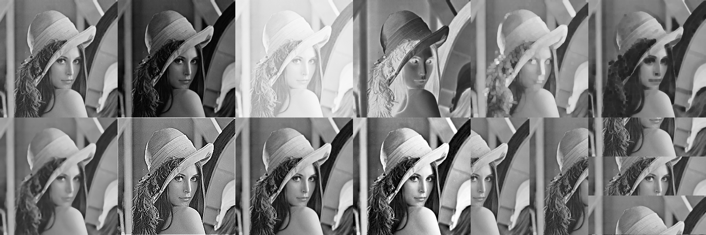

# VARI FILTRI IN PROCESSING

## 1. Immagine di input
La prima immagine in alto a sinistra è il nostro input, [lenna](http://lenna.org/).png.

## 2. Filtro Gamma (incupimento)

$$ g(x,y) = c \cdot f(x,y)^\gamma $$
Con $\gamma$ coefficiente e $c$

$$ c = \frac{255}{255^\gamma} $$

## 3. Filtro Logaritmico (schiarimento)

$$ g(x,y) = c \cdot \log(f(x,y) + 1) $$
Con $\gamma$ coefficiente e $c$

$$ c = \frac{255}{\log(256)}$$

## 4. Filtro di Negativo

$$ neg(x,y) = 255 - f(x,y) $$

## 5. Filtro di Massimo

## 6. Filtro di Minimo

## 7. Filtro Mediano

## 8. Filtro di Sharpening
Inserito come esempio di filtro convolutivo. Viene implementato col seguente Kernel:
$$
K = 
\begin{pmatrix}
  0 & -1 & 0 \\
  -1 & 5 & -1 \\
  0 & -1 & 0
\end{pmatrix}
$$

## 9. Contrast Stretching
È un filtro puntuale basato sulla normalizzazione dei valori di grigio.\
Quando i valori di grigio minimo e massimo non coincidono rispettivamente con 0 e 255, possiamo "stretchare" il range dinamico dell'immagine in maniera tale da coprire il range massimo.

## 10. Equalizzazione
Ottenuto creando in primis l'istogramma dell'immagine.

## 11 e 12. Scambio di parti dell'immagine
Inserito in quanto molto richiesto negli esami.
